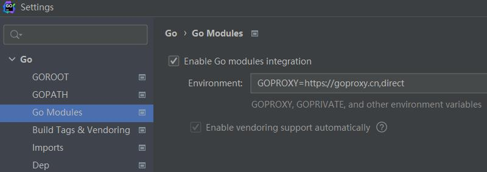

# Golang

## Go语言GOPROXY设置

不同系统设置方式有不同的吗？还不一样？

```bash
go env -w GOPROXY=https://代理地址
```

[Go语言GOPROXY设置_深漂小码哥的博客-CSDN博客](https://blog.csdn.net/qq2942713658/article/details/112915326)
[GOLand设置报错warning: go env -w GOPROXY=... does not override conflicting OS environm_Amazing_deron的博客-CSDN博客](https://blog.csdn.net/Deronn/article/details/108362982)

## go get 安装  verifying module read: connection reset by peer

在安装包的时候出现类似错误，是因为Go env中设置代理的问题，可能是代理服务器网络问题。

[处理 Go 中的 'connection reset by peer' 错误 | lbbniu](https://blog.lbbniu.com/2022/07/28/connection-reset-by-peer/)


```bash
$ GO111MODULE=on go get -u github.com/zeromicro/go-zero/tools/goctl@latest
```

[goctl 安装 | go-zero Documentation](https://go-zero.dev/docs/tasks/installation/goctl)

[Release goctl/v1.5.3 · zeromicro/go-zero](https://github.com/zeromicro/go-zero/releases/tag/tools%2Fgoctl%2Fv1.5.3)

手动下载拷贝到指定 了目录

## .air.toml 文件支持向上级目录监控吗

[air/air_example.toml at master · cosmtrek/air](https://github.com/cosmtrek/air/blob/master/air_example.toml)

[.air.toml 文件在哪里，是要新建根目录下吗 | Go | Go 技术论坛](https://learnku.com/go/t/65077)
[air/README-zh_cn.md at master · cosmtrek/air](https://github.com/cosmtrek/air/blob/master/README-zh_cn.md)

## Go 1.16 中关于 go get 和 go install 

[Go 1.16 中关于 go get 和 go install 你需要注意的地方 - 知乎](https://zhuanlan.zhihu.com/p/338011682)

## 同级目录下其他包无法引用

新项目初始化打开启动时是遇到问题

在写golang时，有时候同级目录下其他包无法引用，这时候勾选enable go modules integration即可解决问题。



设置完应用以后，会索引


goland有两种方式获得包信息。

1. GOPATH。 IDEA 扫描您的 $GOPATH目录以构建包的内部索引并提供代码完成、解析等。
2. Go modules。 IDEA 执行 go list -m -json 来解决您的依赖关系并扫描您的 $GOPATH/pkg/mod 目录（GOMODCACHE 的默认值）以查找包。如果它们不存在，IDEA 会执行 go mod download。在这些操作之后，IDE 提供了所有内置功能，如代码补全等。
   
这两种模式都不会改变您的 Go 或环境变量以及终端中的行为。 当您在设置中选中 Enable Go Modules integration 选项时，IDE 只需将模式从扫描$GOPATH切换到执行 go list 并从 Go Modules 缓存中解析您的依赖项。

### 参考文献

1. [Enable Go modules integration在做什么 - 知乎](https://zhuanlan.zhihu.com/p/563581159)
2. [What does Enable Go modules integration do in Intellij IDE - Stack Overflow](https://stackoverflow.com/questions/68800268/what-does-enable-go-modules-integration-do-in-intellij-ide)

3. [go开发过程中踩的坑_enable go modules integration_jianminfly的博客-CSDN博客](https://blog.csdn.net/jianminfly/article/details/110796130)
4. [新项目初始化 go.mod + vendor - 知乎](https://zhuanlan.zhihu.com/p/425936759)
5. [关于go mod 的使用和goland 配置 go mod - xiaobaiskill - 博客园](https://www.cnblogs.com/xiaobaiskill/p/11819071.html)