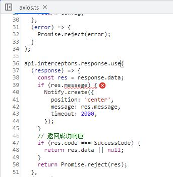

# JavaScript Issue

## Uncaught (in promise) TypeError: Cannot read properties of null

经常遇到的一个错误，要跟踪一下代码很快可以查到原因。

```
Uncaught (in promise) TypeError: Cannot read properties of null (reading 'message')
    at api.interceptors.response.use.message (axios.ts:39:13)
```



这个由于Golang后端接口返回的数据为NULL引起的：


```go title="app/system/internal/handler/auth/moduleaddhandler.go"
func ModuleAddHandler(svcCtx *svc.ServiceContext) http.HandlerFunc {
	return func(w http.ResponseWriter, r *http.Request) {
		var req types.ModuleAddReq
		if err := httpx.Parse(r, &req); err != nil {
			httpx.ErrorCtx(r.Context(), w, err)
			return
		}

		l := auth.NewModuleAddLogic(r.Context(), svcCtx)
		resp, err := l.ModuleAdd(&req)
		if err != nil {
			httpx.ErrorCtx(r.Context(), w, err)
		} else {
			httpx.OkJsonCtx(r.Context(), w, resp) // 这里应是httpx.OkJsonCtx(r.Context(), w, bizresponse.Response(resp, err))
		}
	}
}
```