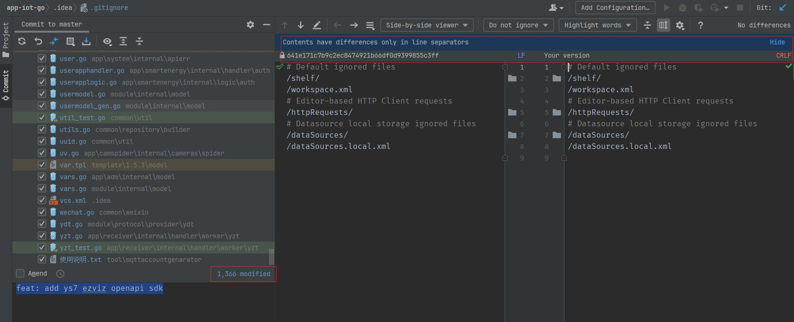
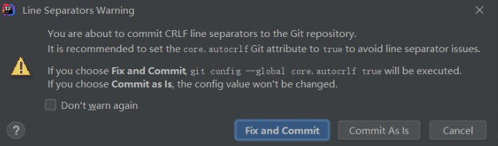

# Windows10新系统开发环境配置

## WSL

```
$ lsb_release -a

$ apt update
```


在我的电脑添加一个网络位置：`\\wsl$\Ubuntu\srv`

```
\\wsl$\Ubuntu-20.04\root\  无法访问
修改wsl ubuntu 默认登录root
ubuntu config --default-user root
```

## 安装WSL

[WSL 的基本命令 | Microsoft Learn](https://learn.microsoft.com/zh-cn/windows/wsl/basic-commands#install)

## 安装Git

```
apt-get install git
git config --global user.name "Your Name"
git config --global user.email "youremail@domain.com"
```

直接从我的Windows10系统下的"C:\Users\Admin\.ssh"拷贝到"/root/.ssh"修改了一下config文件中的IdentityFile /root/.ssh/id_rsa_codeup路径。

clone时报错：

```
root@DESKTOP-7J9I6QH:/srv/server# git clone git@git.yztiot.com:gdyz/app-iot-go.git
Cloning into 'app-iot-go'...
@@@@@@@@@@@@@@@@@@@@@@@@@@@@@@@@@@@@@@@@@@@@@@@@@@@@@@@@@@@
@         WARNING: UNPROTECTED PRIVATE KEY FILE!          @
@@@@@@@@@@@@@@@@@@@@@@@@@@@@@@@@@@@@@@@@@@@@@@@@@@@@@@@@@@@
Permissions 0644 for '/root/.ssh/id_rsa_yztiot' are too open.
It is required that your private key files are NOT accessible by others.
```

意思时ssh的私有密钥的权限太大了。解决方案：将权限由0644降低为0600


```
$ cd /root/.ssh
$ chmod 600 ./*
```

### 配置

```
// 提交时转换为LF，检出时转换为CRLF
git config --global core.autocrlf true 

// 拒绝提交包含混合换行符的文件 （一般设置为true）
git config --global core.safecrlf true  
```

但是在一次修改并提交时，遇到了下面的错误：

```
fatal: LF would be replaced by CRLF in app/smartenergy/internal/handler/routes.go
```





估计原因是：

如果工作区因为新增或编辑出现了 LF 换行符的文件，git add 这些文件时，发现准备提交的文件是 LF 作为换行符，就会出现这个警告，并提示哪些文件是 LF 换行的（但 git 不会对工作区这些文件做换行符的转换）。

手动转换了下，好了。

Goland 可以在底部状态栏显示文件的行结束符。也可以通过点击进行转换。

结论：在 WSL 中编辑的文件通常不需要手动转换行结束符，但如果你需要在不同环境之间共享文件并使用不同的行结束符，可以进行适当的配置。对于纯粹在 Windows 上编辑的文件，通常使用 CRLF 作为行结束符，无需手动转换。

[git如何避免”warning: LF will be replaced by CRLF“提示？ - 知乎](https://www.zhihu.com/question/50862500)

之前也遇到过类似问题，需要注意：

- PHPStorm的Git路径设置成Windows中安装的Git，不要自动检测使用Ubuntu系统中的Git(如果分别在Windows和WSL系统中分别安装了Git的话)
- 这样保持和Windows系统中其他Git客户端TortoiseGit、GitHub Desktop保持一致！(如果在Windows中安装了其他Git客户端的话)

## 安装Go开发环境

删除 /usr/local/go 文件夹（如果存在）来删除任何以前的 Go 安装，然后将刚刚下载的存档解压缩到 /usr/local，在 /usr/local/go 中创建一个新的 Go 目录

```
$ cd /usr/local
$ wget https://go.dev/dl/go1.19.10.linux-amd64.tar.gz
$ rm -rf /usr/local/go && tar -C /usr/local -xzf go1.19.4.linux-amd64.tar.gz
```

将 /usr/local/go/bin 添加到 PATH 环境变量。

```
export GOROOT=/usr/local/go
export GOPATH=/srv/go
export GOBIN=$GOPATH/bin
export PATH=$PATH:$GOBIN
```

### 测试

```
$ go version
warning: GOPATH set to GOROOT (/usr/local/go) has no effect
go version go1.19.10 linux/amd64
```

根据警告信息，你将 GOPATH 设置为了 GOROOT 的路径 /usr/local/go，这是不正确的用法。因为 GOPATH 应该是一个独立于 GOROOT 的目录，用于存储你的 Go 工程和相关依赖。

要解决这个警告，你应该将 GOPATH 设置为一个不同于 GOROOT 的目录。例如，你可以创建一个新的目录作为 GOPATH，如 /home/yourusername/go，然后将 GOPATH 设置为该路径。确保你为 GOPATH 创建的目录具有适当的权限。

### 其他配置

1. GO111MODULE 开启

```
$ go env -w GO111MODULE=on
```

2. 配置 Proxy​

```
$ go env -w GOPROXY=https://goproxy.cn,direct
```

### 参考

https://go-zero.dev/docs/tasks

https://go.dev/dl/

## 安装air

```
go install github.com/cosmtrek/air@latest
```

[cosmtrek/air: ☁️ Live reload for Go apps](https://github.com/cosmtrek/air)

## 安装make

```
apt install make
```

## 登录私有化docker仓库

登录这一个命令即可。

```
docker login registry.yztiot.com
luojianjian
cyh@2021


docker login --username pusher --password yztiot@2013 registry.yztiot.com
docker login --username luojianjian --password-stdin cyh@2021 registry.yztiot.com
```

```
root@DESKTOP-7J9I6QH:/srv/server/app-iot-go# docker login --username pusher --password yztiot@2013 registry.yztiot.com
WARNING! Using --password via the CLI is insecure. Use --password-stdin.
WARNING! Your password will be stored unencrypted in /root/.docker/config.json.
Configure a credential helper to remove this warning. See
https://docs.docker.com/engine/reference/commandline/login/#credentials-store

Login Succeeded
```


## 安装Goland

## 下载

[Thank you for downloading GoLand!](https://www.jetbrains.com/go/download/download-thanks.html)

### 激活

[GoLand安装+破解 - 潆勖 - 博客园](https://www.cnblogs.com/yingxu/p/17456123.html)

[免费提供最新IDEA注册码, IDEA专属激活码, IDEA注册码在线生成](https://idea.javatiku.cn/)

### 不用远程开发

Goland Retrieving IDE versions 

[WSL | GoLand Documentation](https://www.jetbrains.com.cn/en-us/help/go/how-to-use-wsl-development-environment-in-product.html#wsl-general)

### 设置Goland


1. 安装字体

Fira Code Nerd Font

[Releases · ryanoasis/nerd-fonts](https://github.com/ryanoasis/nerd-fonts/releases)

[ryanoasis/nerd-fonts](https://github.com/ryanoasis/nerd-fonts)

2. UI设置

使用旧UI

File | Settings | Appearance & Behavior | New UI

设置字体

File | Settings | Appearance & Behavior | Appearance

File | Settings | Editor | Font

### 去掉Commit Checks：

File | Settings | Version Control | Commit

- Analyze code
- Check TODO
- Go fmt

## 安装NVM和Node

NVM 是一种用于管理设备上的 Node 版本的工具

在 Windows 上安装 NVM

下载并单击 nvm-setup.exe 资源(注意右击选择以管理员身份运行，否则会有权限问题，安装node时也安装不上)，它是该工具的安装文件。

报`access is denied`问题

```
bash: /c/Program Files/nvm/nvm: Permission denied
```

### 使用 nvm 安装Node

安装指定版本，可模糊安装，如：安装 v4.4.0，既可 $ nvm install v4.4.0，又可 $ nvm install 4.4

正常安装成功如下：

注意，也使用以管理员身份运行`Windows PowerShell`

[node.js - Access Denied issue with NVM in Windows 10 - Stack Overflow](https://stackoverflow.com/questions/50563188/access-denied-issue-with-nvm-in-windows-10)

```
$ nvm install 16.20.0
Downloading node.js version 16.20.0 (64-bit)...
Extracting node and npm...
Complete
npm v8.19.4 installed successfully.


Installation complete. If you want to use this version, type

nvm use 16.20.0
```

```
$ nvm install <version>
```

删除已安装的指定版本，语法与 install 用法一致

```
$ nvm uninstall <version>
```

列出所有安装的版本,切换使用指定的版本 node

```
$ nvm ls
$ nvm use <version>
```

## 安装Quasar

全局安装：

```
$ npm i -g @quasar/cli

```

### PowerShell和VSCode终端都无法使用

但是在GitBash命令窗口中可以用：

```
$ quasar -v
@quasar/cli v2.3.0
```

经查：在 Windows 系统上，PowerShell 和 Git Bash 使用不同的执行策略。Git Bash 使用的是 Bash Shell，而 PowerShell 使用的是 PowerShell Shell。默认情况下，Windows 会对不同的 Shell 应用不同的执行策略。

检查当前的执行策略：在以管理员身份运行的 PowerShell 窗口中，执行以下命令来查看当前的执行策略：`Get-ExecutionPolicy`

输出的结果应该是 "Restricted"（受限制）。

修改执行策略：执行以下命令来将执行策略修改为 "RemoteSigned"（仅允许运行远程签名的脚本）：

```
PS C:\Windows\system32> Get-ExecutionPolicy
Restricted
PS C:\Windows\system32> Set-ExecutionPolicy RemoteSigned

执行策略更改
执行策略可帮助你防止执行不信任的脚本。更改执行策略可能会产生安全风险，如 https:/go.microsoft.com/fwlink/?LinkID=135170
中的 about_Execution_Policies 帮助主题所述。是否要更改执行策略?
[Y] 是(Y)  [A] 全是(A)  [N] 否(N)  [L] 全否(L)  [S] 暂停(S)  [?] 帮助 (默认值为“N”): Y
PS C:\Windows\system32> Get-ExecutionPolicy
RemoteSigned
PS C:\Windows\system32> quasar -v
@quasar/cli v2.3.0
```

修改策略以后，解决了，可以运行了。

## 设置VSCode

1. 隐藏顶部的文件的列表

"文件"（File）选项 > "文件"（File）选项 > 单击 "设置"（Settings）。这将打开 VSCode 的设置面板。

输入并搜索：`workbench.editor.showTabs`去掉勾选状态

2. 多项目多活动窗口

"文件"（File）选项 > "文件"（File）选项 > 单击 "设置"（Settings）。这将打开 VSCode 的设置面板。

输入并搜索：`window.openFoldersInNewWindow`设置为`on`
