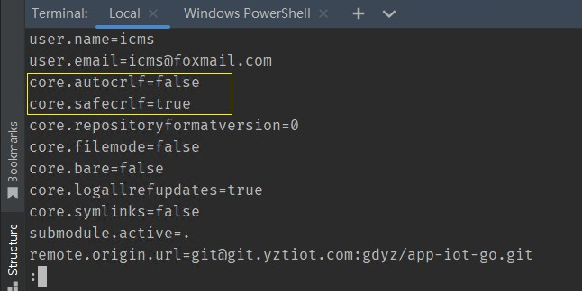
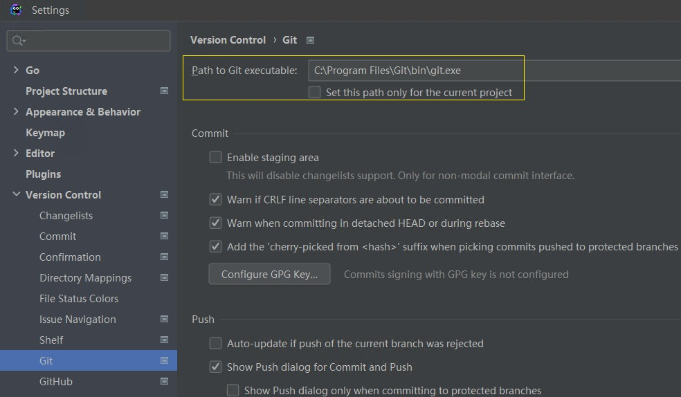
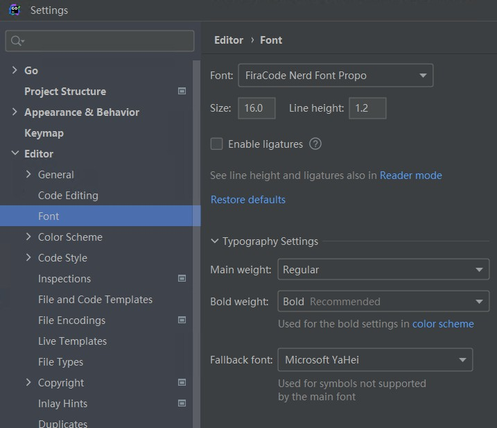
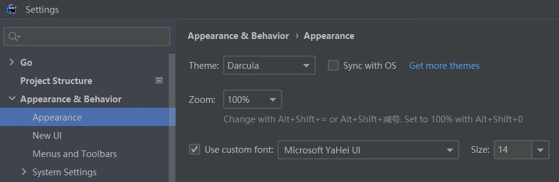
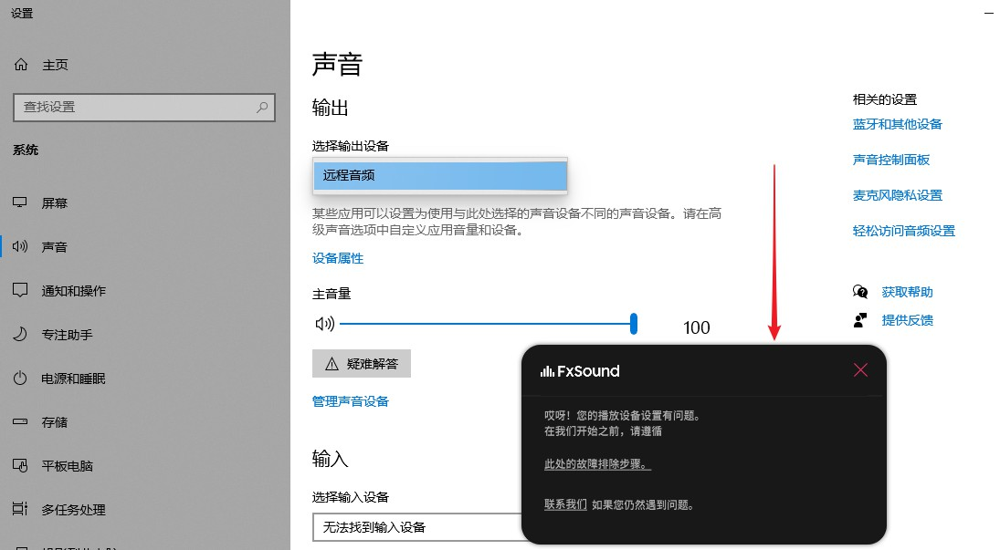
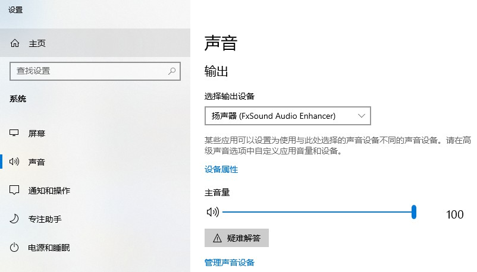
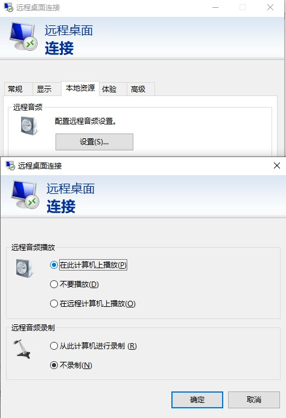
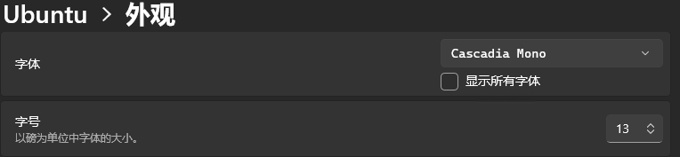

# New System Dev

Windows10新系统开发环境配置

## WSL

```
$ lsb_release -a

$ apt update
```


在我的电脑添加一个网络位置：`\\wsl$\Ubuntu\srv`

```
\\wsl$\Ubuntu-20.04\root\  无法访问
修改wsl ubuntu 默认登录root
ubuntu config --default-user root
```

## 安装WSL

[WSL 的基本命令 | Microsoft Learn](https://learn.microsoft.com/zh-cn/windows/wsl/basic-commands#install)

## 安装Git

```
apt-get install git
git config --global user.name "Your Name"
git config --global user.email "youremail@domain.com"
```

直接从我的Windows10系统下的"C:\Users\Admin\.ssh"拷贝到"/root/.ssh"修改了一下config文件中的IdentityFile /root/.ssh/id_rsa_codeup路径。

clone时报错：

```
root@DESKTOP-7J9I6QH:/srv/server# git clone git@git.yztiot.com:gdyz/app-iot-go.git
Cloning into 'app-iot-go'...
@@@@@@@@@@@@@@@@@@@@@@@@@@@@@@@@@@@@@@@@@@@@@@@@@@@@@@@@@@@
@         WARNING: UNPROTECTED PRIVATE KEY FILE!          @
@@@@@@@@@@@@@@@@@@@@@@@@@@@@@@@@@@@@@@@@@@@@@@@@@@@@@@@@@@@
Permissions 0644 for '/root/.ssh/id_rsa_yztiot' are too open.
It is required that your private key files are NOT accessible by others.
```

意思时ssh的私有密钥的权限太大了。解决方案：将权限由0644降低为0600


```
$ cd /root/.ssh
$ chmod 600 ./*
```

### 配置

```
// 提交时转换为LF，检出时转换为CRLF
git config --global core.autocrlf true 

// 拒绝提交包含混合换行符的文件 （一般设置为true）
git config --global core.safecrlf true  
```

但是在一次修改并提交时，遇到了下面的错误：

```
fatal: LF would be replaced by CRLF in app/smartenergy/internal/handler/routes.go
```


估计原因是：

如果工作区因为新增或编辑出现了 LF 换行符的文件，git add 这些文件时，发现准备提交的文件是 LF 作为换行符，就会出现这个警告，并提示哪些文件是 LF 换行的（但 git 不会对工作区这些文件做换行符的转换）。

手动转换了下，好了。

Goland 可以在底部状态栏显示文件的行结束符。也可以通过点击进行转换。

结论：在 WSL 中编辑的文件通常不需要手动转换行结束符，但如果你需要在不同环境之间共享文件并使用不同的行结束符，可以进行适当的配置。对于纯粹在 Windows 上编辑的文件，通常使用 CRLF 作为行结束符，无需手动转换。

[git如何避免”warning: LF will be replaced by CRLF“提示？ - 知乎](https://www.zhihu.com/question/50862500)

[Git中CRLF与LF的转换 - sandy.simple - 博客园](https://www.cnblogs.com/wangwenhui/p/12141758.html)

之前也遇到过类似问题，需要注意：

- PHPStorm的Git路径设置成Windows中安装的Git，不要自动检测使用Ubuntu系统中的Git(如果分别在Windows和WSL系统中分别安装了Git的话)
- 这样保持和Windows系统中其他Git客户端TortoiseGit、GitHub Desktop保持一致！(如果在Windows中安装了其他Git客户端的话)

### Goland和PHPStorm Git设置

遇到Git拉取错误：

```
Update failed

ssh: Coud not resolve hostnamegit.yztiot.com: Temporary failure inname resolutionCould not read from remote repository.
Please make sure you have the correctaccess rights and the repository exists
```

可能默认使用了Ubuntu中安装的Git，但是未配置，所以没权限。

建议直接将PHPStorm的Git路径设置成Windows中安装的Git，不要自动检测使用Ubuntu系统中的Git。

位置：

File | Settings | Version Control | Git

修改成Windows安装的Git以后正常了：

```
72 files updated in 7 commits
View Commits
```

### 注意在使用WSL时，不同环境下的Git配置

由于在Linux下设置了：`core.autocrlf true`导致拉取下来的git仓库文件异常，导致执行命令时报错：

```
command not found: ^M
```

Windows下设置：`core.autocrlf true`

WSL Ubuntu下设置：`core.autocrlf false`

Windows下Goland中Git使用Windows下的Git






## 安装Go开发环境

删除 /usr/local/go 文件夹（如果存在）来删除任何以前的 Go 安装，然后将刚刚下载的存档解压缩到 /usr/local，在 /usr/local/go 中创建一个新的 Go 目录

```
$ cd /usr/local
$ wget https://go.dev/dl/go1.19.10.linux-amd64.tar.gz // wget https://go.dev/dl/go1.18.10.linux-amd64.tar.gz
$ rm -rf /usr/local/go && tar -C /usr/local -xzf go1.19.4.linux-amd64.tar.gz
```

Go下载连接：`https://go.dev/dl/`

将 /usr/local/go/bin 添加到 PATH 环境变量。

`vi /etc/profile`在末尾添加以下内容：

```
export GOROOT=/usr/local/go
export GOPATH=/srv/go
export GOBIN=$GOPATH/bin
export PATH=$PATH:$GOBIN
```

多版本管理

目的：不同的项目不同的 Go 版本之间，使用单独的 GOPATH 目录。

经询问AI：

如果多个 Go 版本共用相同的 GOPATH 目录，可能会导致冲突和问题。这是因为 GOPATH 目录中包含了依赖包和构建输出，而不同版本的 Go 可能使用不同的依赖包或生成不同的构建输出。

```
export GOROOT=/usr/local/go/1.18.10
export GOPATH=/usr/local/go-path/1.18.10 // 换到相同目录下方便查看管理
export GOBIN=$GOROOT/bin
export PATH=$PATH:$GOBIN
```

执行完成`source /etc/profile`后，关闭终端，重新打开一个新的终端才能生效。

在Goland中设置Go：

File | Settings | Go | GOROOT

```
\\wsl$\Ubuntu\usr\local\go\1.18.10
```

File | Settings | Go | GOPATH

```
\\wsl$\Ubuntu\usr\local\go-path\1.18.10
```

`$GOBIN`设置注意：

GOBIN目录设置为$GOROOT/bin还是$GOPATH/bin下面好？

问AI说：

通过将 GOBIN 设置为 "$GOPATH/bin"，你可以方便地在项目级别上管理和使用项目特定的可执行文件。这样，你可以在不同的项目中使用不同版本的依赖和工具，而不会相互干扰。

总结来说，将 GOBIN 设置为 "$GOPATH/bin" 可以更好地组织和管理项目的可执行文件，使其与其他项目和系统级的 Go 工具分开。

所以上面`export GOBIN=$GOROOT/bin`是错误的， 应该这样配置：

```
export GOROOT=/usr/local/go/1.19.10
export GOPATH=/usr/local/go-path/1.19.10
export GOBIN=$GOPATH/bin
export PATH=$GOROOT/bin:$PATH:$GOBIN  // 必须要有$GOROOT/bin
```

执行完成`source /etc/profile`后，关闭终端，重新打开一个新的终端才能生效。

go 默认的是 GOPATH/bin目录存放go install 命令。

### 注意以下区别

- GOBIN  使用   $GOROOT/bin 还是 $GOPATH/bin
- go get 和 go install 区别
- go mod tidy 和 go mod vendor区别

go get按此顺序执行两项主要操作：

下载并保存在`$GOPATH/src/<import-path>`导入路径中指定的包（源代码）及其依赖项中，然后

执行一个go install

标志-d（go get -d）指示go get下载包后停止；也就是说，它指示go get不要做go install

区别：

go get// 验证是否需要下载包，如果需要则下载然后编译

go install// 跳过包下载部分，直接编译（如果缺少任何包，这将引发错误）

需要注意的是，从 Go 1.16 版本开始，如果使用模块管理依赖，则可以使用 `go install <module-name>` 命令来安装模块的可执行程序。例如：

go install example.com/cmd@latest
其中，example.com/cmd 是模块的名称，@latest 表示下载最新版本的代码。

[go get 和 go install 有什么区别？ - 堆栈溢出](https://stackoverflow.com/questions/24878737/what-is-the-difference-between-go-get-and-go-install)

[go get 和 go install - 知乎](https://zhuanlan.zhihu.com/p/623620456)

[Go环境安装& GoRoot，GoPath，GoBin，Project目录理解_linux go下载fresh应用程序-CSDN博客](https://blog.csdn.net/u010122604/article/details/122156978)

### 测试

```
$ go version
warning: GOPATH set to GOROOT (/usr/local/go) has no effect
go version go1.19.10 linux/amd64
```

根据警告信息，你将 GOPATH 设置为了 GOROOT 的路径 /usr/local/go，这是不正确的用法。因为 GOPATH 应该是一个独立于 GOROOT 的目录，用于存储你的 Go 工程和相关依赖。

要解决这个警告，你应该将 GOPATH 设置为一个不同于 GOROOT 的目录。例如，你可以创建一个新的目录作为 GOPATH，如 /home/yourusername/go，然后将 GOPATH 设置为该路径。确保你为 GOPATH 创建的目录具有适当的权限。

### 其他配置

1. GO111MODULE 开启

```
$ go env -w GO111MODULE=on
```

2. 配置 Proxy​

```
$ go env -w GOPROXY=https://goproxy.cn,direct
```

### 参考

https://go-zero.dev/docs/tasks

https://go.dev/dl/

## 安装air

Installation

Via go install (Recommended)

With go 1.18 or higher:

```
go install github.com/cosmtrek/air@latest
```

[cosmtrek/air: ☁️ Live reload for Go apps](https://github.com/cosmtrek/air)

## 安装Go-Zero goctl

从之前电脑的：`GOBIN="/root/go/bin"`目录下的`goctl`、`goctl4`、`goctl15`

直接拷贝到新电脑：`GOBIN="/usr/local/go/1.19.10/bin"`

## 安装make

```
apt install make
```

## 登录私有化docker仓库

登录这一个命令即可。

```
docker login
```


## 安装Goland

## 下载

[Thank you for downloading GoLand!](https://www.jetbrains.com/go/download/download-thanks.html)

### 激活

[GoLand安装+破解 - 潆勖 - 博客园](https://www.cnblogs.com/yingxu/p/17456123.html)

[免费提供最新IDEA注册码, IDEA专属激活码, IDEA注册码在线生成](https://idea.javatiku.cn/)

### 不用远程开发

Goland Retrieving IDE versions 

[WSL | GoLand Documentation](https://www.jetbrains.com.cn/en-us/help/go/how-to-use-wsl-development-environment-in-product.html#wsl-general)

### 设置Goland


1. 安装字体

Fira Code Nerd Font

[Releases · ryanoasis/nerd-fonts](https://github.com/ryanoasis/nerd-fonts/releases)

[ryanoasis/nerd-fonts](https://github.com/ryanoasis/nerd-fonts)

2. UI设置

使用旧UI

File | Settings | Appearance & Behavior | New UI

设置字体

File | Settings | Appearance & Behavior | Appearance

File | Settings | Editor | Font





### 去掉Commit Checks：

File | Settings | Version Control | Commit

- Analyze code
- Check TODO
- Go fmt

3. 安装插件

- Install Goctl plugin

[goctl-intellij 安装 | go-zero Documentation](https://go-zero.dev/docs/tasks/installation/goctl-intellij)

4. 设置打开文件数量

File | Settings | Editor | General | Editor Tabs

找到**tab limit**设置为30

## 安装NVM和Node

NVM 是一种用于管理设备上的 Node 版本的工具

在 Windows 上安装 NVM

下载并单击 nvm-setup.exe 资源(注意右击选择以管理员身份运行，否则会有权限问题，安装node时也安装不上)，它是该工具的安装文件。

报`access is denied`问题

```
bash: /c/Program Files/nvm/nvm: Permission denied
```

### 使用 nvm 安装Node

安装指定版本，可模糊安装，如：安装 v4.4.0，既可 $ nvm install v4.4.0，又可 $ nvm install 4.4

正常安装成功如下：

注意，也使用以管理员身份运行`Windows PowerShell`

[node.js - Access Denied issue with NVM in Windows 10 - Stack Overflow](https://stackoverflow.com/questions/50563188/access-denied-issue-with-nvm-in-windows-10)

```
$ nvm install 16.20.0
Downloading node.js version 16.20.0 (64-bit)...
Extracting node and npm...
Complete
npm v8.19.4 installed successfully.


Installation complete. If you want to use this version, type

nvm use 16.20.0
```

```
$ nvm install <version>
```

删除已安装的指定版本，语法与 install 用法一致

```
$ nvm uninstall <version>
```

列出所有安装的版本,切换使用指定的版本 node

```
$ nvm ls
$ nvm use <version>
```

## 安装Quasar

全局安装：

```
$ npm i -g @quasar/cli

```

### PowerShell和VSCode终端都无法使用

但是在GitBash命令窗口中可以用：

```
$ quasar -v
@quasar/cli v2.3.0
```

经查：在 Windows 系统上，PowerShell 和 Git Bash 使用不同的执行策略。Git Bash 使用的是 Bash Shell，而 PowerShell 使用的是 PowerShell Shell。默认情况下，Windows 会对不同的 Shell 应用不同的执行策略。

检查当前的执行策略：在以管理员身份运行的 PowerShell 窗口中，执行以下命令来查看当前的执行策略：`Get-ExecutionPolicy`

输出的结果应该是 "Restricted"（受限制）。

修改执行策略：执行以下命令来将执行策略修改为 "RemoteSigned"（仅允许运行远程签名的脚本）：

```
PS C:\Windows\system32> Get-ExecutionPolicy
Restricted
PS C:\Windows\system32> Set-ExecutionPolicy RemoteSigned

执行策略更改
执行策略可帮助你防止执行不信任的脚本。更改执行策略可能会产生安全风险，如 https:/go.microsoft.com/fwlink/?LinkID=135170
中的 about_Execution_Policies 帮助主题所述。是否要更改执行策略?
[Y] 是(Y)  [A] 全是(A)  [N] 否(N)  [L] 全否(L)  [S] 暂停(S)  [?] 帮助 (默认值为“N”): Y
PS C:\Windows\system32> Get-ExecutionPolicy
RemoteSigned
PS C:\Windows\system32> quasar -v
@quasar/cli v2.3.0
```

修改策略以后，解决了，可以运行了。

## 设置VSCode

1. 隐藏顶部的文件的列表

"文件"（File）选项 > "文件"（File）选项 > 单击 "设置"（Settings）。这将打开 VSCode 的设置面板。

输入并搜索：`workbench.editor.showTabs`去掉勾选状态

2. 多项目多活动窗口

"文件"（File）选项 > "文件"（File）选项 > 单击 "设置"（Settings）。这将打开 VSCode 的设置面板。

输入并搜索：`window.openFoldersInNewWindow`设置为`on`

3. 安装扩展

- Vetur
- Vue Language Features (Volar)
- TypeScript Vue Plugin (Volar)

4. 安装并设置字体

`editor.fontFamily`

'JetBrainsMonoNL NF', 'Source_Code_Pro-YaHei Hybrid','FiraCode Nerd Font',

5. 设置快捷键

向下复制行:  "ctrl+d"


## 安装FxSound报错您的播放设备设置有问题

一直在安装完成后，报错：您的播放设备设置有问题

对应英文：FxSound Oops! There’s an issue with your playback device settings.



根据提示跳转到：

https://www.fxsound.com/learning-center/installation-troubleshooting

但是，打开声音设置，发现我的只有一个“远程音频”

### 解决

下载了360驱动大师、驱动精灵、单独下载了声卡驱动程序，重新安装了驱动程序，还安装了 `visual c++ 2015-2022 运行库 x64` 都未解决。

还重新安装了FxSound中文v1.1.18.0，也是一样不行。

FxSound 1.1.18 Multi-CN (2023/06/28)

https://drive.fxsound.com/cs/R3CIo5NuEsJHh7m/downloads3.fxsound.com/fxsound/1.1.18.0/fxsound_setup.exe/download

Realtek HD声卡驱动 V6.0.9235.1 全功能版

https://www.xitongzhijia.net/soft/233444.html

后来发现是因为我是远程桌面连接的我的电脑导致的。只须在连接时做一下设置即可：





### 远程桌面 管理声音设备 远程音频

[Windows远程连接电脑怎么配置远程音频_win怎么设置声音为远程音频-CSDN博客](https://blog.csdn.net/kangkang_01/article/details/124546551)

### 其他参考

https://www.fxsound.com/download

[Oops there's an issue with your playback device settings [OOPS ERROR] - Get Help - FxSound](https://forum.fxsound.com/t/oops-theres-an-issue-with-your-playback-device-settings-oops-error/553)

[求助！安装FxSound 2 pro 的时候出现“Oops!Something went wrong.Please try runn... - 『悬赏问答区』 - 吾爱破解 - LCG - LSG |安卓破解|病毒分析|www.52pojie.cn](https://www.52pojie.cn/thread-1491146-1-1.html)

[这款超好用的 Windows 软件现在可以免费使用了：完全免费、无广告、无功能限制 - 知乎](https://zhuanlan.zhihu.com/p/481135461)

[【折腾】关于新版WIN10音频输出设备的坑 - 哔哩哔哩](https://www.bilibili.com/read/cv4721842/)

[Microsoft Visual C++ 2015-2019 Redistributable (X64) - 14.27.29112 - Microsoft Community](https://answers.microsoft.com/zh-hans/windows/forum/all/microsoft-visual-c-2015-2019-redistributable-x64/8c542878-af2a-4a50-b923-63f062ee4319)

## 安装Foobar2000

关闭时最小化到后台播放

给英文版的用户：

File->Perferences->Default User Interface->Backgroud and Notification：

第一个是关闭后退出 第二个是最小化会到后台，关闭退出，第三个就是关闭最小化到后台。

## Windows Terminal 终端美化

注意仅限美化的是PowerShell，并不是WSL！！！

WSL下安装ohmyzsh即可。

[ohmyzsh/ohmyzsh](https://github.com/ohmyzsh/ohmyzsh)

使用 Oh My Posh 为 PowerShell 或 WSL 设置自定义提示符

```
PS C:\Windows\system32> winget -v
v1.6.3133
PS C:\Windows\system32> winget install JanDeDobbeleer.OhMyPosh -s winget
已找到 Oh My Posh [JanDeDobbeleer.OhMyPosh] 版本 19.2.0
此应用程序由其所有者授权给你。
Microsoft 对第三方程序包概不负责，也不向第三方程序包授予任何许可证。
正在下载 https://github.com/JanDeDobbeleer/oh-my-posh/releases/download/v19.2.0/install-amd64.exe
  ██████████████████████████████  6.23 MB / 6.23 MB
已成功验证安装程序哈希
正在启动程序包安装...
已成功安装
```

### 安装 Nerd Font

重新打开一个新的窗口安装字体

自定义命令提示符通常使用字形（图形符号）来设置提示符的样式。 如果你的字体不包含相应字形，则在整个提示符中，你可能会看到若干 Unicode 替换字符“▯”。

```
PS C:\Windows\system32> oh-my-posh version
19.2.0
PS C:\Windows\system32> oh-my-posh font install
Select font
> FiraCode
Downloading FiraCode
Successfully installed FiraCode 🚀

The following font families are now available for configuration:
  • FiraCode Nerd Font Propo
  • FiraCode Nerd Font Mono
  • FiraCode Nerd Font
```


选择

- 0xProto Nerd Font
- FiraCode Nerd Font

[Fonts | Oh My Posh](https://ohmyposh.dev/docs/installation/fonts)

[Nerd Fonts - Iconic font aggregator, glyphs/icons collection, & fonts patcher](https://www.nerdfonts.com/font-downloads)

安装完成后可以设置字体



### 修改配置文件

查看已安装的模块

```
Get-InstalledModule
```

安装 PSReadLine

PSReadLine 提供了语法高亮、错误提示、多行编辑、键绑定、历史记录搜索等功能：

```
Install-Module PSReadLine
```

安装 posh-git

posh-git 可以在 PowerShell 中显示 Git 状态信息，并提供 Git 命令的自动补全：

```
Install-Module posh-git
```

安装 Oh My Posh

oh-my-posh 提供了多种自定义主题和配色，可以让 PowerShell 更美观实用：

```
Install-Module oh-my-posh
```

选择主题，并使用此命令更新 PowerShell 配置文件。 （可以将 notepad 替换为你选择的文本编辑器。）

PowerShell

```
notepad $PROFILE
```

将以下项添加到 PowerShell 配置文件的末尾，以设置 paradox 主题。

可以通过以下命令查看可用主题：

```
Get-PoshThemes
```


```
oh-my-posh init pwsh --config "$env:POSH_THEMES_PATH\emodipt-extend.omp.json" | Invoke-Expression
```

Windows下路径：Users/admin/AppData/Local/Programs/oh-my-posh/themes/


[Windows 终端自定义提示符设置 | Microsoft Learn](https://learn.microsoft.com/zh-cn/windows/terminal/tutorials/custom-prompt-setup)

[Powershell增强：命令补全、主题美化及Git扩展保姆级教程-腾讯云开发者社区-腾讯云](https://cloud.tencent.com/developer/article/2317806)

[Home | Oh My Posh](https://ohmyposh.dev/)

[PowerShell/PSReadLine: A bash inspired readline implementation for PowerShell](https://github.com/PowerShell/PSReadLine)

[dahlbyk/posh-git: A PowerShell environment for Git](https://github.com/dahlbyk/posh-git)

### WSL 安装 oh my posh

```
curl -s https://ohmyposh.dev/install.sh | bash -s
unzip is required to install Oh My Posh. Please install unzip and try again.
apt install unzip

```

访问Github下载慢，可以设置当前 session 中的请求通过代理访问互联网。从 Linux 子系统访问 Windows 首先需要找到 Windows 的 IP

WSL  github 代理

export ALL_PROXY="http://192.168.50.1:7890" // Windows 的 IP 192.168.50.1


通过 WSL 运行的 Ubuntu-20.04，路径可能如下所示：

\\wsl.localhost\Ubuntu-20.04\home\linuxbrew\.linuxbrew\Cellar\oh-my-posh\6.34.1\themes

```
oh-my-posh init pwsh --config 'https://raw.githubusercontent.com/JanDeDobbeleer/oh-my-posh/main/themes/jandedobbeleer.omp.json' | Invoke-Expression
```

查找到主题目录

```
find / -path "/mnt" -prune -o -name "*.json" -path "*oh-my-posh*" -print
/root/.cache/oh-my-posh/themes/
```


```
vi ~/.profile
eval "$(oh-my-posh init bash --config ~/atomic.omp.json)"
eval "$(oh-my-posh init bash --config ~/M365Princess.omp.json)"
```

[Customize | Oh My Posh](https://ohmyposh.dev/docs/installation/customize)
[Themes | Oh My Posh](https://ohmyposh.dev/docs/themes/#1_shell)
[oh-my-posh/themes/atomic.omp.json at main · JanDeDobbeleer/oh-my-posh](https://github.com/JanDeDobbeleer/oh-my-posh/blob/main/themes/atomic.omp.json)

[Themes | Oh My Posh](https://ohmyposh.dev/docs/themes)

不过安装一个主题，感觉用处不大

直接安装 Oh-My-Zsh

### 安装 oh-my-zsh

Zsh Shell 和 Oh My Zsh什么关系？

Zsh（Z Shell）是一个功能强大的命令行 shell，它是对传统 Bourne shell（如 Bash）的扩展和改进。Zsh 提供了许多有用的功能和高级的命令行交互体验，如自动补全、语法高亮、历史记录管理等。它是许多开发者和系统管理员首选的 shell。

Oh My Zsh 是一个社区驱动的框架和配置管理器，专为 Zsh 设计。它提供了一套丰富的主题、插件和扩展，可以轻松地定制和配置 Zsh，使其更加强大、易用和个性化。Oh My Zsh 的目标是提供一个可定制的 Zsh 配置，使用户能够快速配置和管理他们的命令行环境。

简而言之，Zsh 是一个强大的命令行 shell，而 Oh My Zsh 则是一个在 Zsh 基础上构建的框架和配置管理器，用于扩展和定制 Zsh 的功能和外观。通过使用 Oh My Zsh，你可以轻松地配置和管理你的 Zsh 环境，以满足个人需求和提高工作效率。

Prerequisites:

Zsh should be installed (v4.3.9 or more recent is fine but we prefer 5.0.8 and newer). If not pre-installed (run zsh --version to confirm)

```
$ apt update
$ apt install zsh
$ zsh --version
$ zsh 5.8.1 (x86_64-ubuntu-linux-gnu)
$ sh -c "$(curl -fsSL https://raw.githubusercontent.com/ohmyzsh/ohmyzsh/master/tools/install.sh)"

From https://github.com/ohmyzsh/ohmyzsh
 * [new branch]      master     -> origin/master
Branch 'master' set up to track remote branch 'master' from 'origin'.
Already on 'master'
/srv/server/app-iot-go

Looking for an existing zsh config...
Using the Oh My Zsh template file and adding it to /root/.zshrc.

Time to change your default shell to zsh:
Do you want to change your default shell to zsh? [Y/n]Y
Changing your shell to /usr/bin/zsh...
Shell successfully changed to '/usr/bin/zsh'.
```

[ohmyzsh/ohmyzsh](https://github.com/ohmyzsh/ohmyzsh)
[Themes · ohmyzsh/ohmyzsh Wiki](https://github.com/ohmyzsh/ohmyzsh/wiki/Themes)
[External themes · ohmyzsh/ohmyzsh Wiki](https://github.com/ohmyzsh/ohmyzsh/wiki/External-themes)
[oh-my-zsh 主题样式列表 | 计算机科学论坛](https://learnku.com/articles/53567)

### 配置

1. 修改主题

```
vi ~/.zshrc
source ~/.zshrc
```

1. 安装语法高亮插件（需安装 Git，此处不再赘述）

```
cd ${ZSH_CUSTOM:-~/.oh-my-zsh/custom}/plugins/
git clone https://github.com/zsh-users/zsh-syntax-highlighting.git // 下载不动换了下面
git clone git@github.com:zsh-users/zsh-syntax-highlighting.git
echo "source ${(q-)PWD}/zsh-syntax-highlighting/zsh-syntax-highlighting.zsh" >> ${ZDOTDIR:-$HOME}/.zshrc
source ./zsh-syntax-highlighting/zsh-syntax-highlighting.zsh
```

有两种方式：

[zsh-syntax-highlighting/INSTALL.md at master · zsh-users/zsh-syntax-highlighting](https://github.com/zsh-users/zsh-syntax-highlighting/blob/master/INSTALL.md#in-your-zshrc)

[zsh-syntax-highlighting/INSTALL.md at master · zsh-users/zsh-syntax-highlighting](https://github.com/zsh-users/zsh-syntax-highlighting/blob/master/INSTALL.md#with-a-plugin-manager)

遇到问题，一直出错

```
no such file or directory: /root/.oh-my-zsh/custom/plugins/zsh-syntax-highlighting/zsh-syntax-highlighting.zsh^M
/root/.oh-my-zsh/custom/plugins/zsh-syntax-highlighting/zsh-syntax-highlighting.plugin.zsh:3: command not found: ^M
/root/.oh-my-zsh/custom/plugins/zsh-syntax-highlighting/zsh-syntax-highlighting.plugin.zsh:4: command not found: ^M
/root/.oh-my-zsh/custom/plugins/zsh-syntax-highlighting/zsh-syntax-highlighting.plugin.zsh:5: command not found: ^M
/root/.oh-my-zsh/custom/plugins/zsh-syntax-highlighting/zsh-syntax-highlighting.plugin.zsh:6: command not found: ^M
```

问AI说：

在 Windows Subsystem for Linux (WSL) 中出现 "command not found: ^M" 错误，与在 Linux/Unix 系统中遇到的情况类似。此错误通常是由于文件格式不兼容性引起的，特别是当从 Windows 平台复制文件到 WSL 中时。

想起来：是因为安装Git的时候，为了在Windows系统下Goland使用WSL中的项目，设置了：

```
git config --global core.autocrlf true
```

删除clone下来看文件

```
rm -rf zsh-syntax-highlighting
git config --global core.autocrlf false
git config -l // 确认下
git clone git@github.com:zsh-users/zsh-syntax-highlighting.git
```

正常了。

[Windows Subsystem for Linux（WSL）的安装、美化和增强 - 知乎](https://zhuanlan.zhihu.com/p/340851697)

### 注意在使用WSL时，不同环境下的Git配置

Windows下设置：`core.autocrlf true`

WSL Ubuntu下设置：`core.autocrlf false`

Windows下Goland中Git使用Windows下的Git


3. 和自动补全俩重要插件

```
git clone https://github.com/zsh-users/zsh-autosuggestions ${ZSH_CUSTOM:-~/.oh-my-zsh/custom}/plugins/zsh-autosuggestions
# 如果下载不来

cd ${ZSH_CUSTOM:-~/.oh-my-zsh/custom}/plugins/
git clone git@github.com:zsh-users/zsh-autosuggestions.git
```

Add the plugin to the list of plugins for Oh My Zsh to load (inside ~/.zshrc):

```
$ vi ~/.zshrc
plugins=( 
    # other plugins...
    zsh-autosuggestions
)
```

最终如下：`plugins=(git zsh-syntax-highlighting zsh-autosuggestions)`

Start a new terminal session.

[Windows Subsystem for Linux（WSL）的安装、美化和增强 - 知乎](https://zhuanlan.zhihu.com/p/340851697)

[zsh-autosuggestions/INSTALL.md at master · zsh-users/zsh-autosuggestions](https://github.com/zsh-users/zsh-autosuggestions/blob/master/INSTALL.md#oh-my-zsh)

### 重新设置环境变量

安装完成以后，语法高亮了，提示也有了，但是之前shell中的环境变量没了：`zsh: command not found: air`

```
$ vi /etc/profile
$ source ~/.zshrc

export GOROOT=/usr/local/go/1.19.10
export GOPATH=/usr/local/go-path/1.19.10
export GOBIN=$GOPATH/bin
export PATH=$PATH:$GOROOT/bin:$GOBIN  // 必须要有$GOROOT/bin

$ source source ~/.zshrc
```

### zsh-autosuggestions提示用法

在使用 zsh-autosuggestions 插件时，可以使用以下方法来选择并确认建议：

使用右箭头键：当你输入命令时，zsh-autosuggestions 会在命令行下方显示一个建议。如果你想采纳该建议，可以按下右箭头键将其插入到命令行中。

使用 Tab 键：如果 zsh-autosuggestions 显示了多个建议，你可以使用 Tab 键进行循环选择。按下 Tab 键会自动将建议插入到命令行中。如果有多个建议，你可以多次按下 Tab 键来循环遍历并选择不同的建议。

使用 Enter 键：如果 zsh-autosuggestions 显示了一个建议，并且你想立即确认并执行该建议，可以按下 Enter 键将其插入到命令行中。