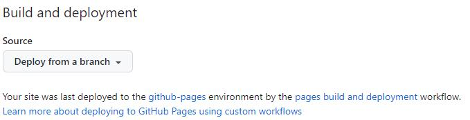
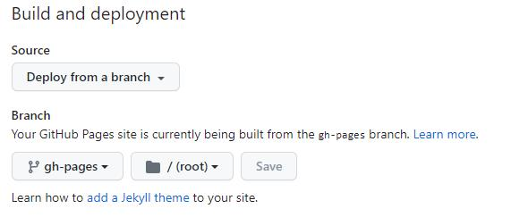

# Tutorial Intro

Let's discover **Docusaurus in less than 5 minutes**.

## Getting Started

Get started by **creating a new site**.

Or **try Docusaurus immediately** with **[docusaurus.new](https://docusaurus.new)**.

### What you'll need

- [Node.js](https://nodejs.org/en/download/) version 16.14 or above:
  - When installing Node.js, you are recommended to check all checkboxes related to dependencies.

## Generate a new site

Generate a new Docusaurus site using the **classic template**.

The classic template will automatically be added to your project after you run the command:

```bash
npm init docusaurus@latest my-website classic
```

You can type this command into Command Prompt, Powershell, Terminal, or any other integrated terminal of your code editor.

The command also installs all necessary dependencies you need to run Docusaurus.

## Start your site

Run the development server:

```bash
cd my-website
npm run start
```

The `cd` command changes the directory you're working with. In order to work with your newly created Docusaurus site, you'll need to navigate the terminal there.

The `npm run start` command builds your website locally and serves it through a development server, ready for you to view at http://localhost:3000/.

Open `docs/intro.md` (this page) and edit some lines: the site **reloads automatically** and displays your changes.

## 安装

按照官方文档安装

[Installation | Docusaurus](https://docusaurus.io/zh-CN/docs/installation)

这个和我的想法很像^_^

把导航菜单Tutorial改为了Docusaurus Tutorial

[Deploying Docusaurus site to GitHub the easy way | William's GitHub Pages](https://wpyoga.dev/blog/2021/06/12/docusaurus-deploy)

## Deploying to GitHub Pages with custom domain

1. 修改和添加配置

```js
# docusaurus.config.js

// GitHub pages deployment config.
// If you aren't using GitHub pages, you don't need these.
organizationName: 'wecms', // Usually your GitHub org/user name.
projectName: 'icmsite-docusaurus', // Usually your repo name.
deploymentBranch: 'gh-pages',
trailingSlash: false, // GitHub Pages adds a trailing slash to Docusaurus URLs by default
```

2. 添加文件`./static/CNAME`

文件内容只有一行，自定义域名`doc-github.prodev.cn`

如果不添加此文件，后续每次部署时，域名会丢失哦！

[[v2] Deploying to GitHub pages removes custom domain from repository settings · Issue #3889 · facebook/docusaurus](https://github.com/facebook/docusaurus/issues/3889)

3. 添加`./static/deploy.sh`shell脚本

为了缩短命令我像`vuepress`那样，写在了一个shell脚本中：

```sh
#!/usr/bin/env sh

# 确保脚本抛出遇到的错误
set -e

# 设置 Git 用户名
export GIT_USER=icms

# 设置 Git 连接方式
export USE_SSH=true

# 部署
yarn deploy
```

然后在中添加以下命令

```json
"scripts": {
  "shell": "sh ./static/deploy.sh",
},
```

最后只要运行`npm run shell`即可部署了。

WARNING

By default, GitHub Pages runs published files through Jekyll. Since Jekyll will discard any files that begin with _, it is recommended that you disable Jekyll by adding an empty file named .nojekyll file to your static directory.

[Deployment | Docusaurus](https://docusaurus.io/zh-CN/docs/deployment#deploying-to-github-pages)

### Environment settings

- USE_SSH:	Set to true to use SSH instead of the default HTTPS for the connection to the GitHub repo. If the source repo URL is an SSH URL (e.g. git@github.com:facebook/docusaurus.git), USE_SSH is inferred to be true.
- GIT_USER: The username for a GitHub account that has push access to the deployment repo. For your own repositories, this will usually be your GitHub username. Required if not using SSH, and ignored otherwise.

环境变量是一种可以被进程访问的变量，它们存储着关于系统环境和配置的信息。当一个变量被导出为环境变量时，这个变量可以被当前Bash终端中的其他进程和子进程所访问和使用。

比如我的这样写：

```sh
GIT_USER=icms USE_SSH=trueGIT_USER=icms USE_SSH=true
# 查看当前Git Bash环境变量
echo $GIT_USER
echo $USE_SSH
```

在 shell 脚本中，export 关键字用于将变量导出为环境变量。

```bash
#!/bin/bash

# 设置 Git 用户名
export GIT_USER=<your-username>

# 设置 Git 连接方式
export USE_SSH=true

# 提交代码
git commit -m "Commit message"
```


### Error

```
fatal: Remote branch gh-pages not found in upstream origin
[INFO] `git clone --depth 1 --branch gh-pages git@github.com:wecms/icmsite-docusaurus.git "C:\Users\Admin\AppData\Local\Temp\icmsite-docusaurus-gh-pagesN1OoRT"` code: 128
Initialized empty Git repository in C:/Users/Admin/AppData/Local/Temp/icmsite-docusaurus-gh-pagesN1OoRT/.git/
[INFO] `git init` code: 0
Switched to a new branch 'gh-pages'
```

因为没有初始化Git仓库。

```
git init
git set origin 
```

报错2

```
fatal: ambiguous argument 'HEAD': unknown revision or path not in the working tree
Use '--' to separate paths from revisions
```

因为没有分支信息，提交一次到master分支后，解决了。

```
Admin@DESKTOP-TCU7QHA MINGW64 /d/Hostv/icmsite-docusaurus/icmsite-docusaurus (master)
$ GIT_USER=icms USE_SSH=true yarn deploy
yarn run v1.22.17
$ docusaurus deploy
[INFO] Deploy command invoked...
[INFO] organizationName: wecms
[INFO] projectName: icmsite-docusaurus
[INFO] deploymentBranch: gh-pages
[INFO] Remote repo URL: git@github.com:wecms/icmsite-docusaurus.git
cf8af11bd4ba06d1f78203e5f3d6f13ff0b59bde
[INFO] `git rev-parse HEAD` code: 0
[INFO] [en] Creating an optimized production build...
i Compiling Client
i Compiling Server
√ Client: Compiled successfully in 5.33s
√ Server: Compiled successfully in 9.06s
[SUCCESS] Generated static files in "build".
```

## 推送分支时触发部署with GitHub Actions

1. 修改Github仓库设置

GitHub Pages Settings

Build and deployment

Source: 选择 Github Actions




2. 编写Workflows文件
   
新建两个文件

- .github/workflows/deploy.yml
- .github/workflows/test-deploy.yml

1. 完成
   
现在推送任意提交到main分支(或者在workflows文件中指定的其他分支), 即可触发GitHub Action, 自动构建并部署GitHub Pages

1. [Deployment | Docusaurus](https://docusaurus.io/zh-CN/docs/deployment#triggering-deployment-with-github-actions)
2. [部署Docusaurus到Github Pages | Kkun Kka](https://kkunkka.github.io/blog/blog/2023/04/14/deploy-docusaurus)
3. [github pages 部署 docusaurus | wkevin](https://wkevin.github.io/blog/2022/04/21/docusaurus.deploy.github/)

### 报错

1. `Error: Dependencies lock file is not found in /home/runner/work/icmsite-docusaurus/icmsite-docusaurus. Supported file patterns: yarn.lock`

通过在`.github\workflows\deploy.yml`中添加`cache-dependency-path`也不行

```
# .github\workflows\deploy.yml
cache-dependency-path: ./frontend/yarn.lock
```

[TIL: GitHub Actions | Fix "Error: Dependencies lock file is not found" - DEV Community](https://dev.to/imomaliev/til-fix-error-dependencies-lock-file-is-not-found-ade)

[GitHub actionsのseup-node@v3で Dependencies lock file is not found](https://zenn.dev/nixieminton/articles/8b26a92feb26d8)

改成使用npm，成功了

:::tip TWEAK THE PARAMETERS FOR YOUR SETUP

These files assume you are using Yarn. If you use npm, change cache: yarn, yarn install --frozen-lockfile, yarn build to cache: npm, npm ci, npm run build accordingly.
:::

[Deployment | Docusaurus](https://docusaurus.io/zh-CN/docs/deployment#triggering-deployment-with-github-actions)

2. `fatal: unable to access 'https://github.com/wecms/icmsite-docusaurus.git/': The requested URL returned error: 403`

You have to configure your repository - Settings -> Action -> General -> Workflow permissions and choose read and write permissions

[Permission denied to github-actions[bot]. The requested URL returned error: 403 - Stack Overflow](https://stackoverflow.com/questions/73687176/permission-denied-to-github-actionsbot-the-requested-url-returned-error-403)

### 不小心点了“Unpublish site”

网页打不开了，重新发布，需要重新设置一下：



### Github Page 不更新

看到Github Actions成功执行了，但是不更新。

把`gh-pages`分支删除了，然后在GitHub Pages Settings页面重新做了一次`Build and deployment`，保存后，更新再推送，解决了。

1. [GitHub Actions 入门教程 - 阮一峰的网络日志](https://www.ruanyifeng.com/blog/2019/09/getting-started-with-github-actions.html)
2. [[解决]Github pages 无法自动更新 « 人生当浮一大白](https://nineteenwj.github.io/archivers/解决-Github-pages-无法自动更新)

### 参考文档

- gitbug pages unpublished 重新发布


1. [取消发布 GitHub Pages 站点 - GitHub 文档](https://docs.github.com/zh/pages/getting-started-with-github-pages/unpublishing-a-github-pages-site)
2. [配置 GitHub Pages 站点的发布源 - GitHub 文档](https://docs.github.com/zh/pages/getting-started-with-github-pages/configuring-a-publishing-source-for-your-github-pages-site)
3. [Publish again unpublished github pages project - Stack Overflow](https://stackoverflow.com/questions/73593914/publish-again-unpublished-github-pages-project)
4. [创建Github.io Page后不小心unpublish了, 如何重新发布_小电动车的博客-CSDN博客](https://blog.csdn.net/weixin_46143152/article/details/129046623)

## 推送分支时触发部署with Cloudflare Pages

在Workers 和 Pages概述页面，点击“创建应用程序”

选择pages

通过导入现有 Git 存储库创建

根据向导，选择一个Github中的存储库，我这里没有全部授权，每添加一个应用需要重新授权选择一个Github仓库。

添加环境变量

```
NODE_VERSION=16
```


