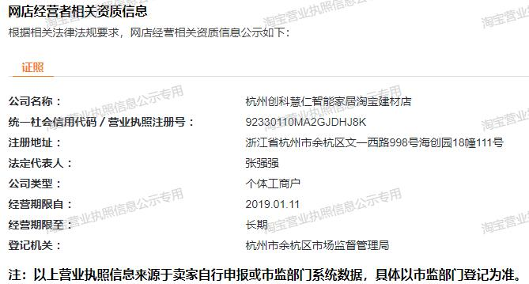
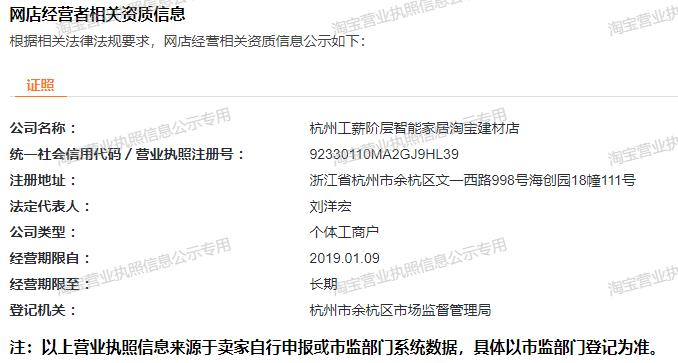
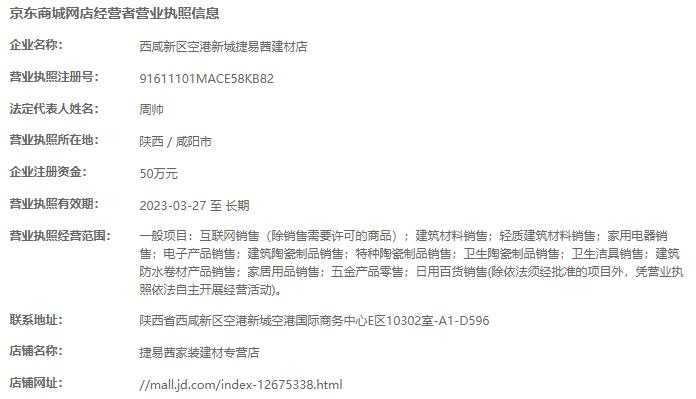

# On the way

不要老是start，应该是startup、On the way了

本地连接都是相对于根目录说的：

[Hometown Henan](./startup/hometown-henan)

## on the way 和 on the road 有区别吗

AI 说：

"on the way" 和 "on the road" 在某种程度上可以表示相似的意思，但在用法和语境上有一些细微的区别。

"On the way"（在途中）通常指的是某人或某物正在前往目的地的过程中。它强调的是旅行或移动的状态，而不一定特指在道路上。例如，你可以说："I'm on the way to the airport"（我正在去机场的路上）或者 "She's on the way home"（她正在回家的路上）。"On the way" 可以用于描述各种交通工具或行程，不一定局限于道路。

"On the road"（在路上）则更强调在道路上行驶，特别是指使用汽车、摩托车或其他交通工具在公路上行驶的过程。它可以表示正在旅行或在路途中的状态。例如，你可以说："We're on the road to the beach"（我们正在去海滩的路上）或者 "He's been on the road for hours"（他已经在路上行驶了几个小时）。"On the road" 更具体地指涉道路上的行驶活动。

总的来说，"on the way"更通用，适用于各种行程和交通方式，而"on the road"则更加专注于道路上的行驶活动。

## TE Connectivity

致力于通过先进的连接和传感器解决方案解决未来的棘手难题。

[关于 TE Connectivity：工业技术的工程创新 | TE Connectivity](https://www.te.com.cn/chn-zh/about-te/our-company.html)

## 合宙IoT

[合宙云平台](https://iot.openluat.com/cloud/main)

[Luat社区](https://doc.openluat.com/wiki/21?wiki_page_id=1912)

### IoT Power功耗测试神器

IOT Power系列产品是功能齐全，稳定可靠的小型手持式功耗测试神器。它可以通过USB C供电，通过屏幕显示数据，并配套功能强大的客户端软件，是广大用户随身携带的理想测试工具。

[IoT Power功耗测试神器 - LuatOS 文档](https://wiki.luatos.com/iotpower/index.html)

[合宙iotpower对比 是德科技3446A 评测-更新中_iot power_凉晓风的博客-CSDN博客](https://blog.csdn.net/liangcsdn111/article/details/122029721)

[IoT Power迷你高精度电源使用教程_哔哩哔哩_bilibili](https://www.bilibili.com/video/BV1mv411T7We/?vd_source=37e495a67612a8945d66bb3c4d4be50c)

[合宙IoT Power到手拆解 - 哔哩哔哩](https://www.bilibili.com/read/cv17952396/)

[仅100台！IoT Power迷你高精度电源首发公测 - 知乎](https://zhuanlan.zhihu.com/p/429295076)

[版本对比 - LuatOS 文档](https://wiki.luatos.com/iotpower/devices.html)

[合宙Air724UG核心板全网通展锐8910平台接口丰富搭配iRTU快速上手-淘宝网](https://item.taobao.com/item.htm?spm=a1z10.5-c-s.w4002-24045920841.11.5b53753cu1PbYK&id=654299247625)

## 河北保定飞凌嵌入式技术有限公司

SoC嵌入式开发产品，ARM嵌入式产品

MCU就是微控制器，别名叫单片机，MCU只是一个芯片，需要配合外围电路才能完成最终产品功能。MCU一般最多只运行实时操作系统(RTOS)，不会上Linux，更多的是”裸机”编程。MCU价格一般比较低，几毛到几十块都有。

低端的SOC就是内部集成了MCU+特定功能模块外设。SoC（System on Chip），中文名是片上系统。SoC含义很多，有一种定义是一个有专用目标的集成电路，是一个包含嵌入式软件的完整系统。SoC方案中，对设备所有智能化操作都是通过模组来实现的，设备无需另外增加MCU。此类控制通常而言比较简单，例如开关，灯之类的产品，只需要几个IO口，就可以控制产品。

[嵌入式设备里，SOC与MCU的区别是什么? - 知乎](https://www.zhihu.com/question/312379687)

[分不清ARM和X86架构，别跟我说你懂CPU！ - 知乎](https://zhuanlan.zhihu.com/p/21266987)

[FCU1201嵌入式控制单元-充电桩、广告牌、新零售、安防、车载、电力通讯 - - 保定飞凌嵌入式技术有限公司](https://www.forlinx.com/product/62.html)

[气象监测仪解决方案 - - 保定飞凌嵌入式技术有限公司](https://www.forlinx.com/huanjing/1151.html)

[嵌入式学习论坛 - Powered by Discuz!](http://bbs.witech.com.cn/forum.php)

[飞凌嵌入式官网-ARM嵌入式核心板、开发板、工控机、单片机解决方案-专注智能设备核心平台研发与制造 - 保定飞凌嵌入式技术有限公司](https://www.forlinx.com/)

[香橙派(Orange Pi)-Orange Pi官网-香橙派开发板,开源硬件,开源软件,开源芯片,电脑键盘](http://www.orangepi.cn/)

[医疗专用显控一体机-10.1寸屏7寸屏电容屏显控一体机4G WiFi工控嵌入式串口安卓FDU - - 保定飞凌嵌入式技术有限公司](https://www.forlinx.com/product/156.html)

[飞凌嵌入式FDU7寸10.1寸医疗电容屏显控一体机工控串口安卓显示器-淘宝网](https://item.taobao.com/item.htm?&id=692835254866&mt=)

[性能最强劲5个的Arm单板开发套件 - 知乎](https://zhuanlan.zhihu.com/p/370491366)

[7寸触摸屏开发板 - Top 100件7寸触摸屏开发板 - 2023年8月更新 - Taobao](https://www.taobao.com/list/product/7%E5%AF%B8%E8%A7%A6%E6%91%B8%E5%B1%8F%E5%BC%80%E5%8F%91%E6%9D%BF.htm)

[成都工控开发：太简单了！串口触摸屏开发HMI的全流程介绍 - 知乎](https://zhuanlan.zhihu.com/p/343016840)

[迅为7寸Android嵌入式安卓触摸屏，工业一体机方案 - topeet - 博客园](https://www.cnblogs.com/topeet/p/8250156.html)

[迅为国产RK3568开发板Android移植 LCD 屏幕-腾讯云开发者社区-腾讯云](https://cloud.tencent.com/developer/article/1979237)

[Android 开发板有哪些？如何选择？ - 知乎](https://www.zhihu.com/question/19970070)

[Android内核开发：开发板选购_51CTO博客_android 开发板](https://blog.51cto.com/ticktick/1651725)

[BeagleBoard - open hardware computers for makers, educators and professionals](https://www.beagleboard.org/)

[开源自己画的4层Android板（打板只要50，成本200左右）_哔哩哔哩_bilibili](https://www.bilibili.com/video/BV1JT4y1N7ZN/?vd_source=37e495a67612a8945d66bb3c4d4be50c)

[触摸设备  |  Android 开源项目  |  Android Open Source Project](https://source.android.google.cn/docs/core/interaction/input/touch-devices?hl=zh-cn)

[Product Selection - ARM嵌入式开发平台与方案提供商](http://www.qiytech.com/products?sdclkid=ALe6152_brDzA6Dsbo&bd_vid=11982313245458432295)

## 4.3寸2.5D水滴屏开发板

[高端智能家居触控开关面板控制灯光窗帘空调多功能86型rs485串口](https://item.taobao.com/item.htm?spm=a21n57.1.0.0.7e7c523cPRsWCs&id=623467089329&ns=1&abbucket=3#detail)

[莱特智能4.3二代2.5D电容IPS86铝合金彩色液晶485 全宅控面板P04](https://item.taobao.com/item.htm?spm=a1z10.5-c.w4002-24752648581.13.1405602b9iInbv&id=601195393446)

资料下载

链接：www.laitecn.com/d.html

请根据文件路径找到自己需要的资料。

[集成商策略-莱特智能家居-淘宝网](https://laitecn.taobao.com/p/rd242679.htm?spm=a1z10.5-c.w5002-24752648550.7.794176a07OB0Yz&scene=taobao_shop)

[莱特未来智能家居 莱特智能家居 LT FUTURE SMARTHOME 智能解决方案](http://www.laitecn.com/#section-home)

https://item.jd.com/10078101408165.html#crumb-wrap

### 其他参考

- 2.5D 智能是控面板
- 4.3寸  2.5D水滴屏

[KNX智能照明系统_智慧照明控制系统-GVS视声](https://www.gvssmart.cn/type-144/)
[海尔HED-H2CP4-5D(haier)智能面板介绍价格参考-海尔官网](https://www.haier.com/business/smarthome/product/znckmb/20210624_162231.shtml)
[华为全屋智能 智能面板及开关 – 华为官网](https://consumer.huawei.com/cn/wholehome/panel-and-switch/)
[液晶智能终端控制面板](https://www.unisiot.com/web/products/product/dc_lcd_intelligent_terminal_panel.html)
[控客API接口开放平台](http://www.ikonke.com/api/)
[默认宝贝分类页-控客旗舰店-天猫Tmall.com](https://kongke.tmall.com/category.htm?spm=a1z10.1-b.w5001-23592730093.3.615c7ba3Baal7B&scene=taobao_shop)
[X8多功能中控网关横板银色 - 搜新智能](https://www.sxznkg.com/prod_details.html?pid=207975&_t=1639968581)

[有没有大佬介绍一下智能酒店客控系统？ - 知乎](https://www.zhihu.com/question/426865372)
[720P曲面小度智能中控屏Air首发体验｜小度智能中控屏Air评测](https://baijiahao.baidu.com/s?id=1746550235140768252)
[智能家居一个面板真的可以控制全屋设备吗？ - 知乎](https://www.zhihu.com/question/422963663)

[关于智能家居面板，你需要知道的五件事 - 知乎](https://zhuanlan.zhihu.com/p/452837621)
[2.5D/3D玻璃产业链 - 知乎](https://zhuanlan.zhihu.com/p/25347054)
[CD-050RAVW-V00A 5寸组态串口屏 串口触摸屏 支持多种组态控件 内置中英文输入法及多语言字库 | 深圳市圣合泰科技有限公司](https://www.panelook.cn/CD-050RAVW-V00A-detail_cn_67948.html)
[2.0D2.5D开关玻璃面板|智能开关触摸屏【奔月玻璃科技有限公司】](http://www.byblkj.com/Product.html?product_category=9)