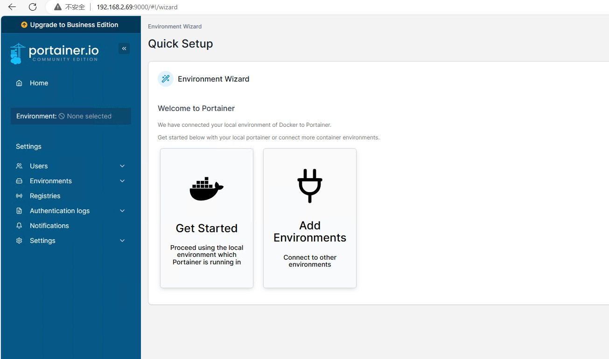
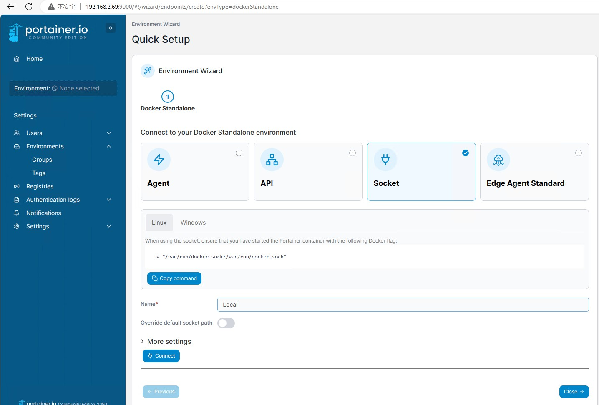

# Docker

## Docker 镜像加速器

Docker Hub 镜像缓存

国内从 Docker Hub 拉取镜像有时会遇到困难，此时可以配置镜像加速器。国内很多云服务商都提供了国内加速器服务，

注意不同系统下操作步骤不同。

### 配置Docker运行时镜像加速器

在不同的操作系统下，配置加速器的方式略有不同

Windows 10 WSL用户：

对于使用 Windows 10 的用户，在任务栏托盘 Docker 图标内右键菜单选择 Settings，打开配置窗口后在左侧导航菜单选择 Docker Engine，在右侧像下边一样编辑 json 文件，之后点击 Apply & Restart 保存后 Docker 就会重启并应用配置的镜像地址了。

[镜像加速器 · Docker -- 从入门到实践](https://docker-practice.github.io/zh-cn/install/mirror.html)

[Docker Hub 源使用帮助 — USTC Mirror Help 文档](https://mirrors.ustc.edu.cn/help/dockerhub.html)

[如何获取和配置镜像加速器_容器镜像服务 ACR-阿里云帮助中心](https://help.aliyun.com/zh/acr/user-guide/accelerate-the-pulls-of-docker-official-images)

### 遇到错误

Go-Zero使用Docker打包时，`resolve image config for docker.io/docker/dockerfile`很长时间或者报错：

```
 => ERROR resolve image config for docker.io/docker/dockerfile:1                                                                                                                                         5176.5s
------
 > resolve image config for docker.io/docker/dockerfile:1:
```

## Portainer Docker Install phpRedisAdmin

- erikdubbelboer/phpredisadmin


[erikdubbelboer/phpRedisAdmin: Simple web interface to manage Redis databases.](https://github.com/erikdubbelboer/phpRedisAdmin)

1. 创建
   
   - name: phpredisadmin
   - Image: erikdubbelboer/phpredisadmin

2. 添加环境变量Environment variables `REDIS_1_HOST`

   - Manual network port publishing(publish a new network port): 2080:80
   - Advanced container settings: network选择redis相同的网络，Env添加一个环境变量REDIS_1_HOST值填写Redis的网络IP地址

添加成功后，即可通过http://REDIS_1_HOST:2080/访问。  REDIS_1_HOST替换成你的地址。

## Docker和Docker-compose安装

1. docker 安装

```
curl -fsSL https://get.docker.com | bash -s docker --mirror Aliyun
```

2. docker-compose 快速安装

```
curl -# -L "https://github.com/docker/compose/releases/download/v2.17.1/docker-compose-linux-x86_64" -o /usr/local/bin/docker-compose
chmod +x /usr/local/bin/docker-compose

# 或者这样下载
curl -# -L https://github.com/docker/compose/releases/download/v2.17.1/docker-compose-`uname -s`-`uname -m` > /usr/local/bin/docker-compose
##################################################################################################### 100.0%
root@DESKTOP-7J9I6QH:/usr/local/bin# ls -ahl
total 52M
drwxr-xr-x  2 root root 4.0K Oct 31 10:04 .
drwxr-xr-x 10 root root 4.0K May  2 05:34 ..
-rwxr-xr-x  1 root root  52M Oct 31 10:04 docker-compose

chmod +x /usr/local/bin/docker-compose
```

文件大小52M左右，这样下载完整了。

## Portainer安装

```
version: "3"
services:
  portainer:
    image: portainer/portainer-ce
    hostname: local-portainer
    container_name: local-portainer
    ports:
      - "9000:9000"  #避免与本机已有portainer冲突
    volumes:
      - /var/run/docker.sock:/var/run/docker.sock
      - ./data:/data
    restart: always
```

这样安装完成全默认跳转到页面：



如果没有出现上述页面，而是Portainer Environment Wizard  没有Get Started：



```
volumes:
   - /var/run/user/1000/docker.sock:/var/run/docker.sock # 这里写错默认sock地址了
```