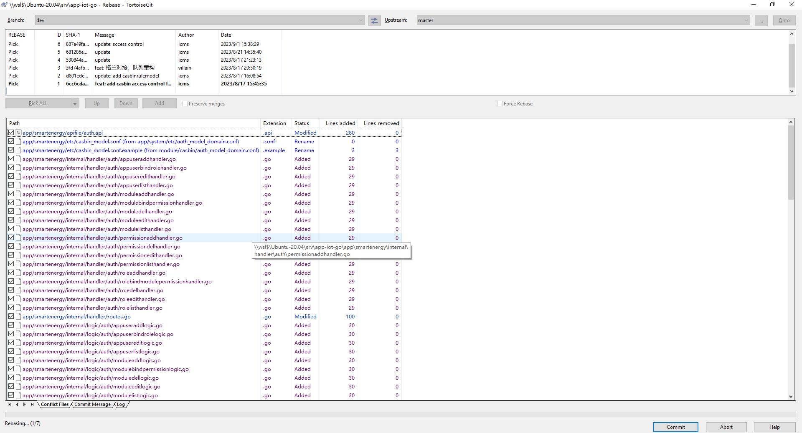

# Docker

## Docker 镜像加速器

Docker Hub 镜像缓存

国内从 Docker Hub 拉取镜像有时会遇到困难，此时可以配置镜像加速器。国内很多云服务商都提供了国内加速器服务，

注意不同系统下操作步骤不同。

### 配置Docker运行时镜像加速器

在不同的操作系统下，配置加速器的方式略有不同

Windows 10 WSL用户：

对于使用 Windows 10 的用户，在任务栏托盘 Docker 图标内右键菜单选择 Settings，打开配置窗口后在左侧导航菜单选择 Docker Engine，在右侧像下边一样编辑 json 文件，之后点击 Apply & Restart 保存后 Docker 就会重启并应用配置的镜像地址了。

[镜像加速器 · Docker -- 从入门到实践](https://docker-practice.github.io/zh-cn/install/mirror.html)

[Docker Hub 源使用帮助 — USTC Mirror Help 文档](https://mirrors.ustc.edu.cn/help/dockerhub.html)

[如何获取和配置镜像加速器_容器镜像服务 ACR-阿里云帮助中心](https://help.aliyun.com/zh/acr/user-guide/accelerate-the-pulls-of-docker-official-images)

### 遇到错误

Go-Zero使用Docker打包时，`resolve image config for docker.io/docker/dockerfile`很长时间或者报错：

```
 => ERROR resolve image config for docker.io/docker/dockerfile:1                                                                                                                                         5176.5s
------
 > resolve image config for docker.io/docker/dockerfile:1:
```

## dev rebase master

我们可以在自己的分支上，把代码变基到协作分支上，这样既不影响和别人的协作，也可以让自己的分支更加的简洁（也要看自己的喜好）。

dev分支压缩commit，这样做有两个好处：整理commit，减少之后rebase的合并次数

把master最新的修改变基合并到dev



[2.30. Rebase - TortoiseGit Documentation](https://documentation.help/TortoiseGit/tgit-dug-rebase.html)

### 参考文献

- tortoisegit rebase upstream
- tortoisegit rebase
- Git merge No Commit   Fast Forward Only
- PHPStorm  解决Git冲突  Plugins


1. [Git超详解五 变基 （看不懂算我输）_git变基是什么意思_小生听雨园的博客-CSDN博客](https://blog.csdn.net/weixin_44154094/article/details/114337077)
2. [使用TortoiseGit执行merge/rebase操作_tortoisemerge怎么用_子津子铭的博客-CSDN博客](https://blog.csdn.net/mmy545237835/article/details/122256665)

PhpStorm 是我非常喜欢的一款 IDE 编辑器，一般在遇到冲突时，我都是直接干代码。

面对 Git 冲突， VSCode 是可以直观的对比展示“原始的代码”的“传入的代码”（好像是这个意思），只需要点一下就可以了。

那么 PhpStorm/WebStorm 这么强大，有没有什么办法可以简单快速的解决 Git 冲突呢？暂时未找到。

### 其他参考

- [TortoiseGit实现分支的新增、合并、删除详细教程_tortoisegit 删除分支_Hello_World_QWP的博客-CSDN博客](https://blog.csdn.net/Hello_World_QWP/article/details/80885480)
- [TortoiseGit使用指南_tortoisegit rebase_海蓝树的博客-CSDN博客](https://blog.csdn.net/xwnxwn/article/details/108742500)
- [分支管理策略 - 廖雪峰的官方网站](https://www.liaoxuefeng.com/wiki/896043488029600/900005860592480)
  