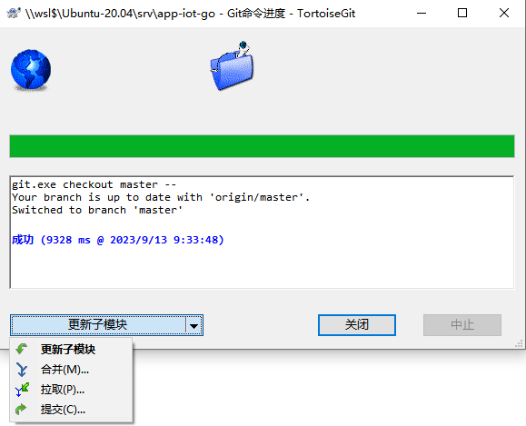
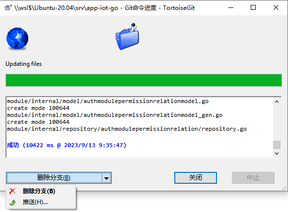
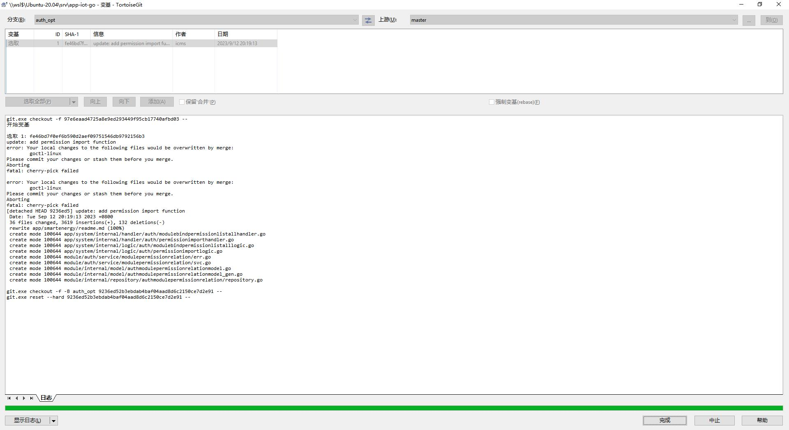

# Git

## Github

不知道什么原因，家里电脑Github克隆我的仓库时报错：

```
$ git clone git@github.com:wecms/icmsite-docusaurus.git
Cloning into 'icmsite-docusaurus'...
Warning: the ECDSA host key for 'github.com' differs from the key for the IP address '140.82.114.4'
Offending key for IP in /c/Users/ICMS/.ssh/known_hosts:6
Matching host key in /c/Users/ICMS/.ssh/known_hosts:7
Are you sure you want to continue connecting (yes/no)? yes
git@github.com: Permission denied (publickey).
fatal: Could not read from remote repository.

Please make sure you have the correct access rights
and the repository exists.
```

```
ssh-keygen -t rsa -C "icms@foxmail.com"
```

重新生成又提示：

```
$ ssh -T git@github.com
@@@@@@@@@@@@@@@@@@@@@@@@@@@@@@@@@@@@@@@@@@@@@@@@@@@@@@@@@@@
@    WARNING: REMOTE HOST IDENTIFICATION HAS CHANGED!     @
@@@@@@@@@@@@@@@@@@@@@@@@@@@@@@@@@@@@@@@@@@@@@@@@@@@@@@@@@@@
IT IS POSSIBLE THAT SOMEONE IS DOING SOMETHING NASTY!
Someone could be eavesdropping on you right now (man-in-the-middle attack)!
It is also possible that a host key has just been changed.
The fingerprint for the RSA key sent by the remote host is
SHA256:uNiVztksCsDhcc0u9e8BujQXVUpKZIDTMczCvj3tD2s.
Please contact your system administrator.
Add correct host key in /c/Users/ICMS/.ssh/known_hosts to get rid of this messag                                                                                                                                                                                               e.
Offending RSA key in /c/Users/ICMS/.ssh/known_hosts:1
RSA host key for github.com has changed and you have requested strict checking.
Host key verification failed.
```

问AI说，这可能表示主机密钥（host key）发生了变化。这通常发生在你之前连接过该主机，但现在它的密钥发生了更改。

如果你之前连接过该主机，并且你信任该主机的身份验证，可以尝试更新你本地SSH密钥缓存中的主机密钥。你可以使用以下命令来删除旧的主机密钥缓存：

```
ssh-keygen -R github.com
```

这将删除已知主机密钥缓存中的GitHub主机密钥。

如果你之前没有连接过该主机，或者你不确定是否应该信任新的主机密钥，可以手动验证主机密钥的指纹。打开终端，运行以下命令：

```
ssh-keyscan github.com
```

这将返回GitHub主机的公钥指纹。比较这个指纹与GitHub官方文档或其他可信来源中的指纹是否匹配。如果匹配，则可以选择接受该密钥并继续克隆操作。如果不匹配，可能存在安全风险，应该谨慎继续操作。

我执行了`ssh-keygen -R github.com`以后，正常了。

挽回旧的密钥也正常了。

### 参考文献

[Xshell的下载与使用 - 知乎](https://zhuanlan.zhihu.com/p/196664911)

## 递归子模块

git submodule add 可将其他仓库作为本仓库的子模块，并保持父项目和子项目相互独立。面对比较复杂的项目时，经常会用到。

综上，记住两点：子模块是另一个仓库！子模块是另一个仓库！子模块是另一个仓库！重要的话说三遍。 更新子模块不会自动更新主模块的引用！更新子模块不会自动更新主模块的引用！更新子模块不会自动更新主模块的引用！重要的话同样说三遍！


- --recurse-submodules

1. [Git - Submodules](https://git-scm.com/book/en/v2/Git-Tools-Submodules)
2. [Git - 子模块](https://git-scm.com/book/zh/v2/Git-%E5%B7%A5%E5%85%B7-%E5%AD%90%E6%A8%A1%E5%9D%97)
3. [Git Submodule 使用 - 知乎](https://zhuanlan.zhihu.com/p/374662328)
4. [来说说坑爹的 git submodule - 掘金](https://juejin.cn/post/6844903920645455879)

### TortoiseGit 使用子模块

当子模块更改后，在使用子模块的项目中，在主目录、在非子模块文件夹右击鼠标，pull 操作并不能将子模块修改的内容同步到项目中。在子模块文件夹右击鼠标，pull 操作可以将子模块修改的内容同步到项目中。在父目录右击鼠标，pull 操作并不能将子模块修改的内容同步到项目中。

什么是 Git 子模块

Git 子模块是指在一个 Git 仓库中嵌套使用其他 Git 仓库的功能。当我们需要在一个项目中使用一个或多个外部库或模块时，可以使用 Git 子模块将这些外部库或模块作为子项目添加到主项目中。

- TortoiseGit  submodules 子模块
  
1. [Submodules – TortoiseGit – Documentation – TortoiseGit – Windows Shell Interface to Git](https://tortoisegit.org/docs/tortoisegit/tgit-dug-submodules.html)
2. [TortoiseGit 入门指南17：使用子模块_tortoisegit添加子模块_研究是为了理解的博客-CSDN博客](https://blog.csdn.net/zhzht19861011/article/details/131945875)
3. [TortoiseGit 入门指南17：使用子模块](http://element-ui.cn/article/show-1730763.html?action=onClick)
4. [Git 使用 TortoiseGit 拉取 Git 子模块|极客教程](https://geek-docs.com/git/git-questions/76_git_pulling_git_submodules_with_tortoisegit.html)

## 疑问：Git 新建一个开发分支 开发好了再合并 会冲突吗

## Git 

```bash
git clone -b dev git@git.yztiot.com:gdyz/app-iot-go.git
```

## TortoiseGit 切换开发分支 变基开发分支

切换到master分支，更新





开发分支在开发过程中，变基，根据上游master




### dev rebase master

我们可以在自己的分支上，把代码变基到协作分支上，这样既不影响和别人的协作，也可以让自己的分支更加的简洁（也要看自己的喜好）。

dev分支压缩commit，这样做有两个好处：整理commit，减少之后rebase的合并次数

把master最新的修改变基合并到dev


[2.30. Rebase - TortoiseGit Documentation](https://documentation.help/TortoiseGit/tgit-dug-rebase.html)

### 参考文献

- tortoisegit rebase upstream
- tortoisegit rebase
- Git merge No Commit   Fast Forward Only
- PHPStorm  解决Git冲突  Plugins


1. [Git超详解五 变基 （看不懂算我输）_git变基是什么意思_小生听雨园的博客-CSDN博客](https://blog.csdn.net/weixin_44154094/article/details/114337077)
2. [使用TortoiseGit执行merge/rebase操作_tortoisemerge怎么用_子津子铭的博客-CSDN博客](https://blog.csdn.net/mmy545237835/article/details/122256665)

PhpStorm 是我非常喜欢的一款 IDE 编辑器，一般在遇到冲突时，我都是直接干代码。

面对 Git 冲突， VSCode 是可以直观的对比展示“原始的代码”的“传入的代码”（好像是这个意思），只需要点一下就可以了。

那么 PhpStorm/WebStorm 这么强大，有没有什么办法可以简单快速的解决 Git 冲突呢？暂时未找到。

### 其他参考

- [TortoiseGit实现分支的新增、合并、删除详细教程_tortoisegit 删除分支_Hello_World_QWP的博客-CSDN博客](https://blog.csdn.net/Hello_World_QWP/article/details/80885480)
- [TortoiseGit使用指南_tortoisegit rebase_海蓝树的博客-CSDN博客](https://blog.csdn.net/xwnxwn/article/details/108742500)
- [分支管理策略 - 廖雪峰的官方网站](https://www.liaoxuefeng.com/wiki/896043488029600/900005860592480)
  
## Git 常规使用

TortoiseGit 合并分支