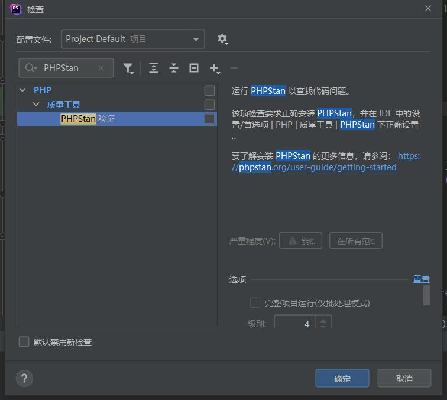

# Goland PHPStorm

## 经常索引慢


## PHPStorm语法检查 关闭





## Goland Terminal中的Go Version是怎么变为Go1.19的

WSL Ubuntu系统中安装了两个Go版本，Go1.18和Go1.19两个版本，但是Goland Terminal是怎么默认为Go1.19的？

在使用Go1.19版本开发的系统中，两次遇到：

```
compile: version "go1.18" does not match go tool version "go1.19"
```

第一次记得是清除了Goland缓存重新启动解决的。

第二次是在Goland Terminal中设置了`$GOROOT`环境变量`/root/sdk/go1.19`解决的。

```
compile: version "go1.18" does not match go tool version "go1.19"

$ echo $GOROOT
$ /root/sdk/go1.18
$ export GOROOT=/root/sdk/go1.19
$ echo $GOROOT
$ /root/sdk/go1.19
```

### 参考文献

- Go  多个版本 compile: version  does not match go tool version

1. [go版本匹配错误解决 - 简书](https://www.jianshu.com/p/fa04bcbffcc1)
2. [go 1.15.2升级到 go 1.16.3遇到的问题: version “go1.16.3“ does not match go tool version “go1.15.2“_bkzy的博客-CSDN博客](https://blog.csdn.net/weixin_41621706/article/details/115898144)
3. [go版本匹配错误解决_go tool version_nicoxix的博客-CSDN博客](https://blog.csdn.net/nxb593427560/article/details/82972601)

## Go多版本引起的冲突问题

```
root@DESKTOP-TCU7QHA:/srv/app-iot-3# go get github.com/casbin/casbin-pg-adapter
go: downloading github.com/casbin/casbin-pg-adapter v1.2.1
go: github.com/casbin/casbin-pg-adapter@v1.2.1: verifying module: github.com/casbin/casbin-pg-adapter@v1.2.1: Get "https://proxy.golang.com.cn/sumdb/sum.golang.org/lookup/github.com/
casbin/casbin-pg-adapter@v1.2.1": read tcp 192.168.50.2:54970->60.188.67.206:443: read: connection reset by peer
```

`ping proxy.golang.com.cn`也是通的，可能是代理的问题，修改了一个阿里云代理，可以安装了。

```
go env -w GOPROXY=https://mirrors.aliyun.com/goproxy/
export GOPROXY=https://mirrors.aliyun.com/goproxy/

go env -w GOPROXY=https://mirrors.aliyun.com/goproxy/,direct

go env -w GOPROXY=https://mirrors.aliyun.com/goproxy/,direct
warning: go env -w GOPROXY=... does not override conflicting OS environment variable

root@DESKTOP-TCU7QHA:/srv/app-iot-3#GO111MODULE=on go get -u github.com/casbin/casbin-pg-adapter
go: downloading github.com/casbin/casbin-pg-adapter v1.2.1
go: downloading github.com/go-pg/pg/v10 v10.9.1
go: downloading github.com/mmcloughlin/meow v0.0.0-20181112033425-871e50784daf
go: downloading mellium.im/sasl v0.2.1
go: downloading github.com/go-pg/zerochecker v0.2.0
go: downloading github.com/jinzhu/inflection v1.0.0
go: downloading github.com/vmihailenco/msgpack/v5 v5.3.0
go: downloading github.com/vmihailenco/tagparser v0.1.2
go: downloading github.com/tmthrgd/go-hex v0.0.0-20190904060850-447a3041c3bc
go: downloading github.com/vmihailenco/bufpool v0.1.11
go: downloading github.com/vmihailenco/tagparser/v2 v2.0.0
go: added github.com/casbin/casbin-pg-adapter v1.2.1
go: added github.com/go-pg/pg/v10 v10.9.1
go: added github.com/go-pg/zerochecker v0.2.0
go: added github.com/jinzhu/inflection v1.0.0
go: added github.com/mmcloughlin/meow v0.0.0-20181112033425-871e50784daf
go: added github.com/tmthrgd/go-hex v0.0.0-20190904060850-447a3041c3bc
go: added github.com/vmihailenco/bufpool v0.1.11
go: added github.com/vmihailenco/msgpack/v5 v5.3.0
go: added github.com/vmihailenco/tagparser v0.1.2
go: added github.com/vmihailenco/tagparser/v2 v2.0.0
go: added mellium.im/sasl v0.2.1
```

又有问题

```
github.com/Masterminds/squirrel@v1.5.4: is explicitly required in go.mod, but not marked as explicit in vendor/modules.txt
github.com/alibabacloud-go/darabonba-openapi/v2@v2.0.4: is explicitly required in go.mod, but not marked as explicit in vendor/modules.txt
github.com/alibabacloud-go/iot-20180120/v4@v4.1.3: is explicitly required in go.mod, but not marked as explicit in vendor/modules.txt
github.com/alibabacloud-go/tea@v1.2.0: is explicitly required in go.mod, but not marked as explicit in vendor/modules.txt
```

为了解决这个问题，您可以尝试以下步骤：

确认依赖项的一致性：运行 go mod tidy 命令，它会自动调整 go.mod 文件中的依赖项以匹配实际使用的依赖项版本，并更新 vendor/modules.txt 文件。这可以确保两个文件之间的一致性。

清理 vendor 目录：如果问题仍然存在，您可以尝试清理 vendor 目录并重新生成它。您可以运行以下命令：

```
go mod vendor
```

删除 vendor 目录和 modules.txt 文件：您可以手动删除 vendor 目录和 vendor/modules.txt 文件，并重新运行 go mod vendor 命令重新生成它们。

更新 Go 版本：确保您使用的是最新版本的 Go，以避免与 Go Modules 相关的已知问题。

## synchronizing files slow

synchronizing files slow

windows WSL下的 goland synchronizing files 非常慢

1. [synchronizing files takes days and doesn't stop – IDEs Support (IntelliJ Platform) | JetBrains](https://intellij-support.jetbrains.com/hc/en-us/community/posts/360003425160-synchronizing-files-takes-days-and-doesn-t-stop)
2. [windows下的 goland synchronizing files 非常慢_qq5cbd62bd202f1的技术博客_51CTO博客](https://blog.51cto.com/u_14301180/5364561)
3. [【IDEA】idea一直不停的scanning files to index 解决方法 - Angel挤一挤 - 博客园](https://www.cnblogs.com/sxdcgaq8080/p/12607912.html)

### E5-2690 Cpu索引变快了

换了Intel(R) Xeon(R) CPU E5-2690 v3以后，索引文件好像快了一些。


## Goland 取消commit时自动格式化

- Goland  Git  Commit 禁止 Go Fmt  Analyzing

File | Settings | Version Control | Commit

找到：**Before Commit**把下面的勾选去掉即可。

- Analyze code Choose profile
- Go fmt

## IntelliJ IDEA 自带的 HTTP Client

[IntelliJ IDEA 自带的 HTTP Client 接口调用插件，吊打 Postman_idea http调用_陈皮的JavaLib的博客-CSDN博客](https://blog.csdn.net/chenlixiao007/article/details/116425259)

[IDEA HTTP Client（史上最全） - 疯狂创客圈 - 博客园](https://www.cnblogs.com/crazymakercircle/p/14317222.html)

[HTTP Client | PhpStorm Documentation](https://www.jetbrains.com/help/phpstorm/http-client-in-product-code-editor.html)

[JetBrains/phpstorm-http-client-tutorial](https://github.com/JetBrains/phpstorm-http-client-tutorial)

## 相比VSCode插件 REST Client

[[VSCode插件推荐] REST Client: 也许是比Postman更好的选择 - 知乎](https://zhuanlan.zhihu.com/p/54266685)

[VSCode的REST Client指南，超好用的HTTP客户端工具 - 知乎](https://zhuanlan.zhihu.com/p/382740857)

