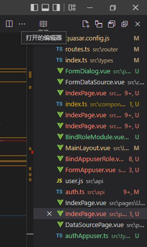

# VS Code

## VS Code Git

无法把推送按钮添加到按钮栏

vscode source control add custom button

[visual studio code - How do I create a custom button in VSCode Source Control tab? - Stack Overflow](https://stackoverflow.com/questions/75893497/how-do-i-create-a-custom-button-in-vscode-source-control-tab)

[Source Control with Git in Visual Studio Code](https://code.visualstudio.com/docs/sourcecontrol/overview)

## VS Code 扩展

[增强 Git 的最佳 VS Code 扩展](https://www.zhihu.com/tardis/zm/art/438758692?source_id=1005)

## Vue 代码自动格式化扩展

## 横屏显示竖屏打开文件列表

点击【查看 > 打开视图...】打开面板，选择“打开的编辑器 辅助侧边栏”即可。

