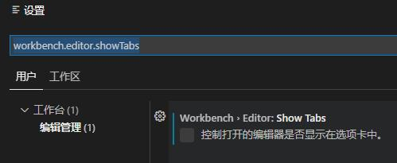
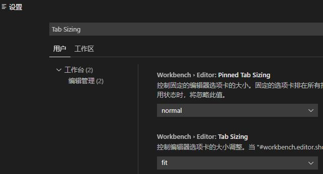
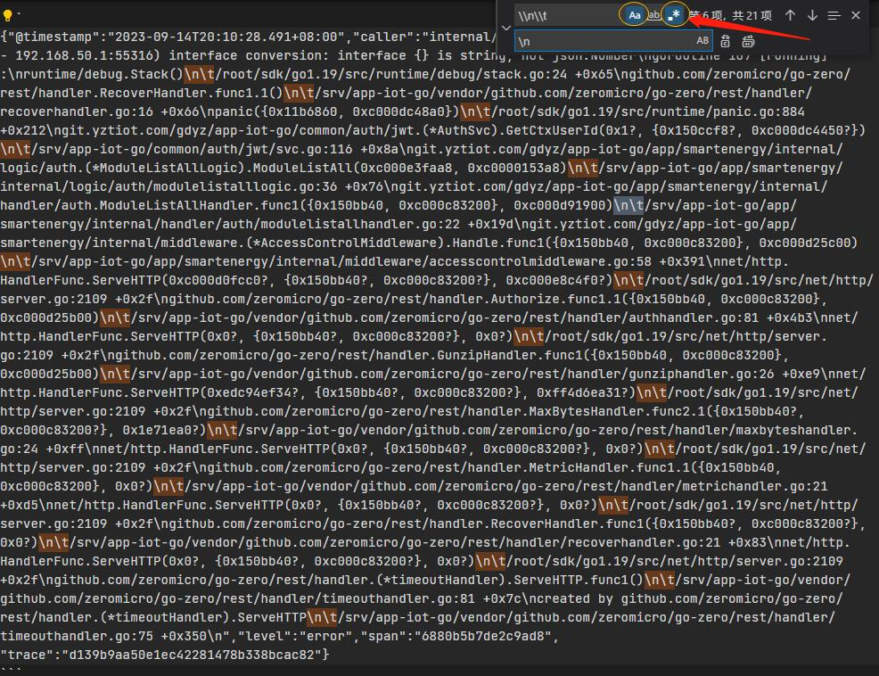

# VS Code


## VS Code Git

无法把推送按钮添加到按钮栏

vscode source control add custom button

[visual studio code - How do I create a custom button in VSCode Source Control tab? - Stack Overflow](https://stackoverflow.com/questions/75893497/how-do-i-create-a-custom-button-in-vscode-source-control-tab)

[Source Control with Git in Visual Studio Code](https://code.visualstudio.com/docs/sourcecontrol/overview)

## VS Code 扩展

[增强 Git 的最佳 VS Code 扩展](https://www.zhihu.com/tardis/zm/art/438758692?source_id=1005)

## Vue 代码自动格式化扩展


## 横屏显示竖屏打开文件列表

点击【查看 > 打开视图...】打开面板，选择“打开的编辑器 辅助侧边栏”即可。


同时，可以取消顶部显示打开的编辑器列表，这样可以完美的像PHPStorm竖排文件列表一样了，可以打开很多文件了，哈哈！！！

"文件"（File）选项 > "文件"（File）选项 > 单击 "设置"（Settings）。这将打开 VSCode 的设置面板。

输入并搜索：`workbench.editor.showTabs`通过勾选状态

- 默认）：显示打开的编辑器列表。
- 未勾选状态：隐藏打开的编辑器列表。



但是文字字体太小了，不好看清楚，暂未找到修改的方法

- vscode设置侧边资源管理器文字大小



[编程技巧-vscode 资源管理器的字体font修改 - 知乎](https://zhuanlan.zhihu.com/p/642240130)

## 设置永久自动换行

默认是关闭的，需要ALT+Z换行

【文件->首选项->设置】搜索`wordWrap`，找到`editor.wordWrapColumn`选择on即可

其他选项还有：

- wordWrapColumn // 将在指定的换行列限制内自动换行
- bounded // 根据编辑器窗口的宽度和布局自动计算出一个合适的换行列限制

左上角code-首选项-设置，找到"editor.wordWrap"属性，该属性默认值为off，改为“wordWrapColumn”。vscode的"editor.wordWrapColumn"默认值为80，即每行80字符时自动换行。

```
{"@timestamp":"2023-09-14T20:10:28.491+08:00","caller":"internal/log.go:57","content":"(/api/auth/module/list-all - 192.168.50.1:55316) interface conversion: interface {} is string, not json.Number\ngoroutine 107 [running]:\nruntime/debug.Stack()\n\t/root/sdk/go1.19/src/runtime/debug/stack.go:24 +0x65\ngithub.com/zeromicro/go-zero/rest/handler.RecoverHandler.func1.1()\n\t/srv/app-iot-go/vendor/github.com/zeromicro/go-zero/rest/handler/recoverhandler.go:16 +0x66\npanic({0x11b6860, 0xc000dc48a0})\n\t/root/sdk/go1.19/src/runtime/panic.go:884 +0x212\ngit.yztiot.com/gdyz/app-iot-go/common/auth/jwt.(*AuthSvc).GetCtxUserId(0x1?, {0x150ccf8?, 0xc000dc4450?})\n\t/srv/app-iot-go/common/auth/jwt/svc.go:116 +0x8a\ngit.yztiot.com/gdyz/app-iot-go/app/smartenergy/internal/logic/auth.(*ModuleListAllLogic).ModuleListAll(0xc000e3faa8, 0xc0000153a8)\n\t/srv/app-iot-go/app/smartenergy/internal/logic/auth/modulelistalllogic.go:36 +0x76\ngit.yztiot.com/gdyz/app-iot-go/app/smartenergy/internal/handler/auth.ModuleListAllHandler.func1({0x150bb40, 0xc000c83200}, 0xc000d91900)\n\t/srv/app-iot-go/app/smartenergy/internal/handler/auth/modulelistallhandler.go:22 +0x19d\ngit.yztiot.com/gdyz/app-iot-go/app/smartenergy/internal/middleware.(*AccessControlMiddleware).Handle.func1({0x150bb40, 0xc000c83200}, 0xc000d25c00)\n\t/srv/app-iot-go/app/smartenergy/internal/middleware/accesscontrolmiddleware.go:58 +0x391\nnet/http.HandlerFunc.ServeHTTP(0xc000d0fcc0?, {0x150bb40?, 0xc000c83200?}, 0xc000e8c4f0?)\n\t/root/sdk/go1.19/src/net/http/server.go:2109 +0x2f\ngithub.com/zeromicro/go-zero/rest/handler.Authorize.func1.1({0x150bb40, 0xc000c83200}, 0xc000d25b00)\n\t/srv/app-iot-go/vendor/github.com/zeromicro/go-zero/rest/handler/authhandler.go:81 +0x4b3\nnet/http.HandlerFunc.ServeHTTP(0x0?, {0x150bb40?, 0xc000c83200?}, 0x0?)\n\t/root/sdk/go1.19/src/net/http/server.go:2109 +0x2f\ngithub.com/zeromicro/go-zero/rest/handler.GunzipHandler.func1({0x150bb40, 0xc000c83200}, 0xc000d25b00)\n\t/srv/app-iot-go/vendor/github.com/zeromicro/go-zero/rest/handler/gunziphandler.go:26 +0xe9\nnet/http.HandlerFunc.ServeHTTP(0xedc94ef34?, {0x150bb40?, 0xc000c83200?}, 0xff4d6ea31?)\n\t/root/sdk/go1.19/src/net/http/server.go:2109 +0x2f\ngithub.com/zeromicro/go-zero/rest/handler.MaxBytesHandler.func2.1({0x150bb40?, 0xc000c83200?}, 0x1e71ea0?)\n\t/srv/app-iot-go/vendor/github.com/zeromicro/go-zero/rest/handler/maxbyteshandler.go:24 +0xff\nnet/http.HandlerFunc.ServeHTTP(0x0?, {0x150bb40?, 0xc000c83200?}, 0x0?)\n\t/root/sdk/go1.19/src/net/http/server.go:2109 +0x2f\ngithub.com/zeromicro/go-zero/rest/handler.MetricHandler.func1.1({0x150bb40, 0xc000c83200}, 0x0?)\n\t/srv/app-iot-go/vendor/github.com/zeromicro/go-zero/rest/handler/metrichandler.go:21 +0xd5\nnet/http.HandlerFunc.ServeHTTP(0x0?, {0x150bb40?, 0xc000c83200?}, 0x0?)\n\t/root/sdk/go1.19/src/net/http/server.go:2109 +0x2f\ngithub.com/zeromicro/go-zero/rest/handler.RecoverHandler.func1({0x150bb40?, 0xc000c83200?}, 0x0?)\n\t/srv/app-iot-go/vendor/github.com/zeromicro/go-zero/rest/handler/recoverhandler.go:21 +0x83\nnet/http.HandlerFunc.ServeHTTP(0x0?, {0x150bb40?, 0xc000c83200?}, 0x0?)\n\t/root/sdk/go1.19/src/net/http/server.go:2109 +0x2f\ngithub.com/zeromicro/go-zero/rest/handler.(*timeoutHandler).ServeHTTP.func1()\n\t/srv/app-iot-go/vendor/github.com/zeromicro/go-zero/rest/handler/timeouthandler.go:81 +0x7c\ncreated by github.com/zeromicro/go-zero/rest/handler.(*timeoutHandler).ServeHTTP\n\t/srv/app-iot-go/vendor/github.com/zeromicro/go-zero/rest/handler/timeouthandler.go:75 +0x350\n","level":"error","span":"6880b5b7de2c9ad8","trace":"d139b9aa50e1ec42281478b338bcac82"}
```

这是一段Go-Zero错误日志，不换行、不手动替换`\n\t`为`\n`换行符很难看出是什么错？


1. 首先按上述方式设置自动换行
2. 按【CTRL+H】`\\n\\t`选中“区分大小写”“使用正则表达式”按钮，替换为`\n`即可。



### 参考

- Visual Studio Code  默认自动换行
- Visual Studio Code中查找\n\t并​​替换为换行符
- 正则表达式哪些需要转义
- Visual Studio Code中查找并​​替换为换行符

需要转义的字符:`* . ? + ^ $ | \ / [ ] ( ) { }`


[vscode 代码中查找并替换为换行符 - 30岁再次出发 - 博客园](https://www.cnblogs.com/lgj8/p/15038016.html)
[VSCode将某个字符替换为换行符 并换行显示 - 简书](https://www.jianshu.com/p/3535203a8885)

## 怎么设置打开的编辑器将始终显示在辅助侧边栏的选项卡中，而不会自动隐藏或折叠。

问AI说：

1. 【文件->首选项->设置】搜索 `workbench.editor.showTabs` // 这个不对，是顶部的Tabs
2. 勾选该设置项，确保它被设置为 "on"（开启）
3. 【文件->首选项->设置】搜索：`workbench.editor.showTabs`通过勾选状态

这样设置后，打开的编辑器将始终显示在辅助侧边栏的选项卡中，而不会自动隐藏或折叠。

暂时未找到设置的地方。

Open Editors  Secondary Side Bar

### 设置语言

打开 显示（View） 菜单，选择 命令面板（Command Palette） 菜单项或（ Ctrl+Shift+P ）快捷键 打开命令面板。
在命令面板中，输入 Configure Display Language ，选择 Configure Display Language 命令，显示已安装的语言包列表。
在已安装的语言包列表中选择需要切换的语言包。
根据提示重启VScode完成切换。
