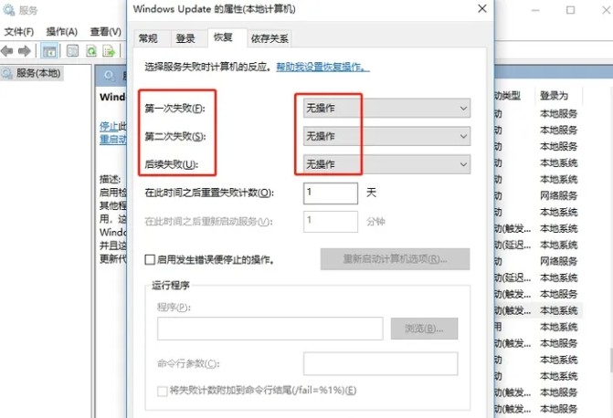

# Windows 10

## Windows 删除输入法Windows 删除输入法

Windows+U，输入: 编辑语言和键盘选项

在【首选语言 > 添加语言】一栏下方，点击“中文(简体，中国)”，注意，只有点击选中了“中文(简体，中国)”以后，下面才会显示【选项】按钮哦。

进入到语言选项后，在下面【键盘】一栏下方就是当前安装的输入法，还是要点击选中以后，就会出现“删除”按钮，注意须要点击选中。只有一个输入时无法删除的。

## 下载文件到 Linux 子系统 WSL 时，自动生成带有 Zone.Identifier 同名文件

当在Windows系统中软件Chrome浏览器中，下载文件到Linux 子系统 WSL 目录时，会自动生成一个带有Zone.Identifier 同名文件。

设置下载目录到Windows系统目录下，就没有此问题。

当通过 Windows 资源管理器拷贝文件到 Linux 子系统时，WSL 会自动为每个文件附加一个带有 Zone.Identifier 标识的同名文件。这是 NTFS 文件系统的一种安全防护机制，意在对外部文件的来源进行跟踪，但对于 WSL 来说，这个功能应该属于 bug 且已经有人在 GitHub 上向微软开发团队反馈 [#7456](https://github.com/microsoft/WSL/issues/7456)。

### 解决方案

打开组策略(按win+r，输入 gpedit.msc 回车)

打开【用户配置->管理模板->Windows 组件->附件管理器】

编辑右侧的 **文件附件中不保留区域信息**，选择 **已启用** 然后点击确定保存就可以。

### 参考文献

1. [在 WSL 中使用 JuiceFS | JuiceFS Document Center](https://juicefs.com/docs/zh/community/tutorials/juicefs_on_wsl/)
2. [取消复制文件到共享目录自动生成:Zone.Identifier文件 - 虚拟笔记](https://www.notevm.com/a/6232.html)
3. [去掉:Zone.Identifier文件_evandeng2009的博客-CSDN博客](https://blog.csdn.net/evandeng2009/article/details/52354991)
4. [WSL 中出现 :Zone.Identifier 文件的原因和解决方法 - sulinehk's blog - 专注于计算机科学与软件工程的技术博客](https://www.sulinehk.com/post/reasons-and-solutions-for-the-zone.identifier-file-appearing-in-wsl/)
5. [Zone.Identifier Files when downloading from Windows to WSL file structure · Issue #7456 · microsoft/WSL](https://github.com/microsoft/WSL/issues/7456)

## 高效搜索文件

[在 Windows 10 上高效搜文件，自带搜索功能其实就够了 - 知乎](https://zhuanlan.zhihu.com/p/75821635)

[Windows 10文件夹中的一些高级搜索技巧_win10 高级搜索_Smilecoc的博客-CSDN博客](https://blog.csdn.net/qq_42692386/article/details/120044702)

## 字体

用 Georgia 字体时，输入数字总是大小起起伏伏的

[用 Georgia 字体时，输入数字总是大小起起伏伏的，有没有修补办法？ - 知乎](https://www.zhihu.com/question/19833330)

[识别性最佳的数字字体是什么？ - 知乎](https://www.zhihu.com/question/28406652)

## 自定义 Windows Terminal 终端界面

[自定义 Windows Terminal 终端界面与配色方案 - 志文工作室](https://lzw.me/a/windows-terminal-custom.html)

- https://github.com/microsoft/terminal/releases/
- https://docs.microsoft.com/zh-cn/windows/terminal/custom-terminal-gallery/custom-schemes
- https://docs.microsoft.com/zh-cn/windows/terminal/tutorials/powerline-setup
- https://ohmyposh.dev/docs/configure/

## 启动远程桌面

我的电脑右键->属性->远程桌面->启用远程桌面(勾选)即可。

然后在其他电脑使用“远程桌面连接”便可以远程连接。

## 桌面图标设置

桌面右键->个性化->主题->桌面图标设置

## 更新升级以后同意个人数据跨境传输

怎么关闭呢？

你出现下面这个蓝色界面之后，你按键盘的shift+F10（如果没弹出就按Win+E打开资源管理器，在按Win+R）不出现就多按几次

输入taskmgr 然后回车,这时会打开任务管理找到里面的Microsoft帐户，点击该进程，并右键结束掉该进程即可。

### 永久解决这个情况

在设置>查看更新历史记录页面，卸载掉相关更新。按下面一步步来。

1. 打开 菜单-》设置

2. 查看更新历史记录

3. 卸载更新

4. 找到有(KB5031356)这串字符的安全更新，右键卸载掉。然后重启即可永久解决（前提是你不安装这个更新）

### 禁止系统安装这个更新包

Windows如何隐藏不需要的更新?

卸载了该补丁包后不久又会被系统自动安装回去，只有禁止系统安装这个更新包才不会再出现这个恶心人的强制弹窗了。

windows官方工具 wushowhide.diagcab 支持对指定编号的更新包进行屏蔽。

1. 下载并安装 wushowhide.diagcab 工具，官方下载链接：

http://download.microsoft.com/download/F/2/2/F22D5FDB-59CD-4275-8C95-1BE17BF70B21/wushowhide.diagcab

2. 下载完成以后，双击运行，“下一步”，等待系统自动完成补丁列表扫描；

3. 选择“Hide updates”, 勾选要屏蔽的更新补丁号（KB5028166）；

4. “下一步”，直至完成。

5. 如果没有需要屏蔽的更新可以重启电脑后再次尝试；如果你反悔了想重新获取那个更新就点击“Show hidden updates”

[教你解决掉windows提示同意个人数据跨境传输（KB5028166） | 鳗鱼是条狗 | KingGoo | KingGoo技术博客](https://kinggoo.com/microsoft-kb5028166.htm)

[windows系统弹窗“同意个人数据跨境传输”跳过并永久屏蔽KB5028166安全补丁方法 - IT摇篮曲](https://www.itylq.com/sorrow-of-windows-data-privacy.html)

[屏蔽 Windows 各种更新 | GuCATs'摸鱼站](https://goo-aw233.github.io/zh-CN/tutorial/Windows/blockfeatureupd/)

### windows10永久关闭更新

一、禁用Windows Update服务

1、通过键盘Win + R健，弹出运行对话框，输入命令 services.msc ，按“确定”按钮，即可打开服务弹窗。

2、往下拉，寻找到找到Windows Update，双击打开。

3、双击打开弹框，点击“停止”，将启动类型选为“禁用”，最后点击确定。

4、然后切换到“恢复”选项，将第一次失败、第二次失败、后续失败全部修改为“无操作”，点击“应用”“确定”。

二、通过组策略关闭Win10自动更新相关服务

1、按Win + R 组合键，调出运行命令操作弹框，输入“gpedit.msc”，点击确定。

2、于本地组策略编辑器左侧菜单栏，依次选择：计算机配置 -> 管理模板 -> Windows组件 -> Windows更新。

3、双击右侧“配置自动更新”，弹出框中设置为“已禁用”，点击“应用”并“确定”。

4、接着再找到“删除使用所有Windows更新功能的访问权限”，双击弹出框，设置已启用，然后“确定”。

三、禁止任务计划中的Win10自动更新服务

1、按 Win + R键，调出运行弹框，输入“taskschd.msc”，并“确定”。

2、于任务计划程序弹框中，依次选择：任务计划程序库 -> Microsoft -> Windows -> WindowsUpdate，将其展示出来的项目均设置为 [ 禁用 ]。

四、通过注册表关闭Win10自动更新功能

1、按Win + R 组合键，在弹出的运行框中输入：regedit，确定。

2、在注册表编辑器中找到：HKEY_LOCAL_MACHINE\SYSTEM\CurrentControlSet\Services\UsoSvc。然后在右侧找到“Start”键。

3、双击start，在弹出框中把基数改成：16进制，数值数据改为“4”，点击确定。

4、右侧找到“FailureActions”，双击弹出框中，把“0010”、“0018”行的左起第5个数值由原来的“01”改为“00”， “确定”。这样我们就可以彻底把win10自动更新永久关闭。

其实，之所以很多知友没办法永久地关闭win10自动更新功能，主要还是只对某个方面进行的设置操作，如果我们想永久关闭，就应该从Windows Update服务、组策略、计划任务、注册表这四个方面来设置，这样才能够达到我们的目的。

[WIN10系统如何彻底永久关闭自动更新?建议收藏! - 知乎](https://zhuanlan.zhihu.com/p/391195241)

## Folder Size显示文件夹大小[Windows]

Folder Size – 15+ 年老工具，吸附在资源管理器旁，显示文件夹大小[Windows]

### Folder Size 下载

官网：http://foldersize.sourceforge.net/

下载：https://sourceforge.net/projects/foldersize/files/foldersize/2.6/

[Folder Size - 15+ 年老工具，吸附在资源管理器旁，显示文件夹大小[Windows] - 小众软件](https://www.appinn.com/folder-size-for-windows/)
