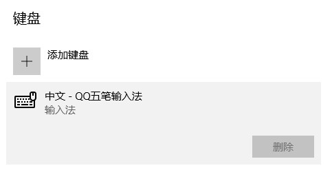

# Windows 10

## Windows 删除输入法Windows 删除输入法

Windows+U，输入: 编辑语言和键盘选项

在【首选语言 > 添加语言】一栏下方，点击“中文(简体，中国)”，注意，只有点击选中了“中文(简体，中国)”以后，下面才会显示【选项】按钮哦。

进入到语言选项后，在下面【键盘】一栏下方就是当前安装的输入法，还是要点击选中以后，就会出现“删除”按钮，注意须要点击选中。只有一个输入时无法删除的。

## 下载文件到 Linux 子系统 WSL 时，自动生成带有 Zone.Identifier 同名文件

当在Windows系统中软件Chrome浏览器中，下载文件到Linux 子系统 WSL 目录时，会自动生成一个带有Zone.Identifier 同名文件。

设置下载目录到Windows系统目录下，就没有此问题。

当通过 Windows 资源管理器拷贝文件到 Linux 子系统时，WSL 会自动为每个文件附加一个带有 Zone.Identifier 标识的同名文件。这是 NTFS 文件系统的一种安全防护机制，意在对外部文件的来源进行跟踪，但对于 WSL 来说，这个功能应该属于 bug 且已经有人在 GitHub 上向微软开发团队反馈 [#7456](https://github.com/microsoft/WSL/issues/7456)。

### 解决方案

打开组策略(按win+r，输入 gpedit.msc 回车)

打开【用户配置->管理模板->Windows 组件->附件管理器】

编辑右侧的 **文件附件中不保留区域信息**，选择 **已启用** 然后点击确定保存就可以。

### 参考文献

1. [在 WSL 中使用 JuiceFS | JuiceFS Document Center](https://juicefs.com/docs/zh/community/tutorials/juicefs_on_wsl/)
2. [取消复制文件到共享目录自动生成:Zone.Identifier文件 - 虚拟笔记](https://www.notevm.com/a/6232.html)
3. [去掉:Zone.Identifier文件_evandeng2009的博客-CSDN博客](https://blog.csdn.net/evandeng2009/article/details/52354991)
4. [WSL 中出现 :Zone.Identifier 文件的原因和解决方法 - sulinehk's blog - 专注于计算机科学与软件工程的技术博客](https://www.sulinehk.com/post/reasons-and-solutions-for-the-zone.identifier-file-appearing-in-wsl/)
5. [Zone.Identifier Files when downloading from Windows to WSL file structure · Issue #7456 · microsoft/WSL](https://github.com/microsoft/WSL/issues/7456)

## 高效搜索文件

[在 Windows 10 上高效搜文件，自带搜索功能其实就够了 - 知乎](https://zhuanlan.zhihu.com/p/75821635)

[Windows 10文件夹中的一些高级搜索技巧_win10 高级搜索_Smilecoc的博客-CSDN博客](https://blog.csdn.net/qq_42692386/article/details/120044702)

## 字体

用 Georgia 字体时，输入数字总是大小起起伏伏的

[用 Georgia 字体时，输入数字总是大小起起伏伏的，有没有修补办法？ - 知乎](https://www.zhihu.com/question/19833330)

[识别性最佳的数字字体是什么？ - 知乎](https://www.zhihu.com/question/28406652)

## 自定义 Windows Terminal 终端界面

[自定义 Windows Terminal 终端界面与配色方案 - 志文工作室](https://lzw.me/a/windows-terminal-custom.html)

- https://github.com/microsoft/terminal/releases/
- https://docs.microsoft.com/zh-cn/windows/terminal/custom-terminal-gallery/custom-schemes
- https://docs.microsoft.com/zh-cn/windows/terminal/tutorials/powerline-setup
- https://ohmyposh.dev/docs/configure/

## 启动远程桌面

我的电脑右键->属性->远程桌面->启用远程桌面(勾选)即可。

然后在其他电脑使用“远程桌面连接”便可以远程连接。

## 桌面图标设置

桌面右键->个性化->主题->桌面图标设置
